# Panopticon

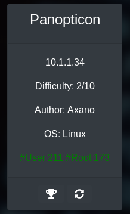

__MACHINE IP__: 10.1.1.34

__DATE__: 16/05/2019

__START TIME__: 8:23

----


`NMAP`
------

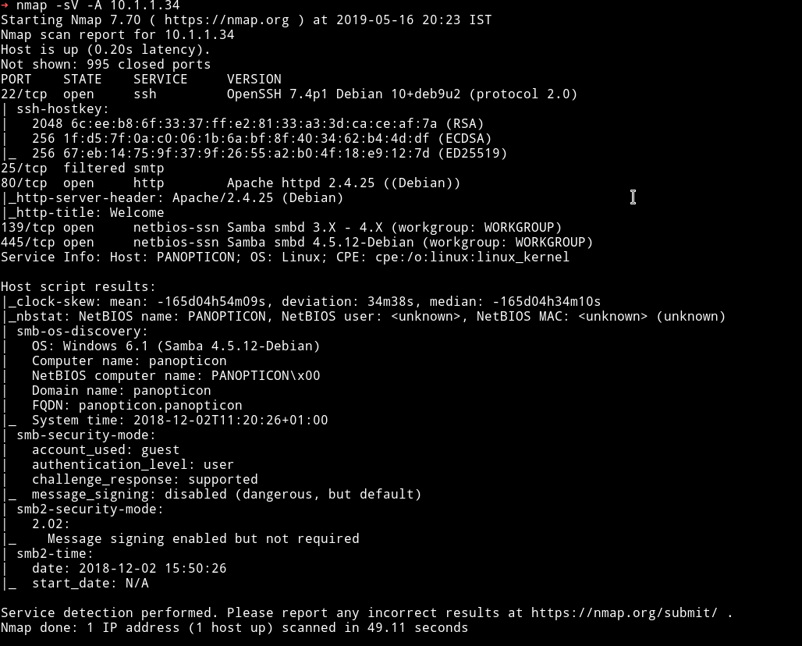

There are the usual ports like 22 and 80. And then there's a suspicious port running samba service.

But first lets enumerate with `diresearch`

`dirsearch`
--------

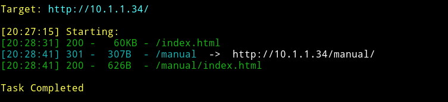

Okay so there's nothing on the website except the `manual` which had nothing interesting.

----

Okay so time to read the source of the website.

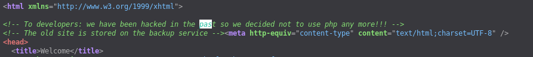

Hmmm....meaning there's backup some where. But if we didn't find anything via `dirsearch` then it leaves the `samba` services

---

I wasted lot of time understanding how to access files using `smbclient`.
First I was trying to use exploit for the specific  version and what not but then I finally figure it out.

Okay so let's run `enum4linux` to see what all information we can find.

It's gives lot of output but we found what we wanted to.

[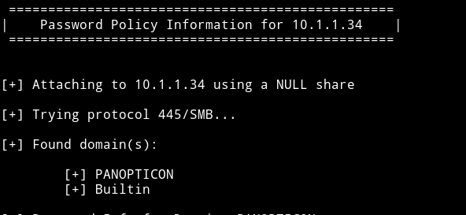

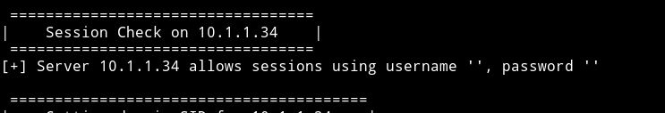


This means we can read the `public` shares by running the following command:

`smbclient -I 10.1.1.34 "//PANOPTICON/public" -U "" -N`

- This command basically takes us to `public` shares of `PANOPTICON` domain on the said IP.
- `-U ""` is refering to No user name
- `-N` means no password


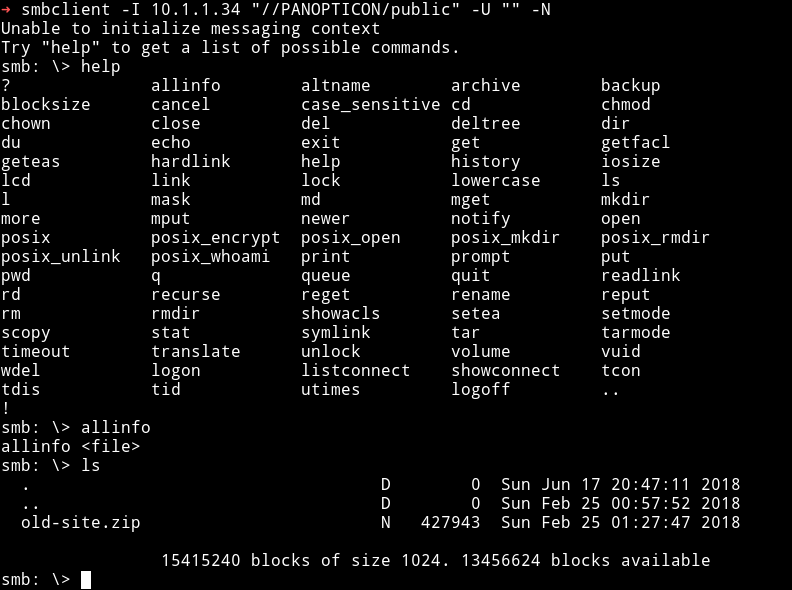

Here we can see that there's the old site they were talking about.

We can `mget` command to get the zip file.

After getting those file I unzipped them which gave me a folder named [`php-site-master`](php-site-master) and in the [`app/config/config.php`](php-site-master/app/config/config.php) I found the password

```php
    <?php

$config = new Phalcon\Config(array(
    'database' => array(
        'adapter' => 'mysql',
        'host' => 'localhost',
        'username' => 'seer',
        'password' => 'IS33Something',
        'dbname' => 'php_site'
    ),
    'phalcon' => array(
        'controllersDir' => '/../app/controllers/',
        'modelsDir' => '/../app/models/',
        'libraryDir' => '/../app/library/',
        'viewsDir' => '/../app/views/',
        'baseUri' => '/php-site/'
    ),
    'models' => array(
        'metadata' => array(
            'adapter' => 'Apc',
            'lifetime' => 86400
        )
    )
));
```
Now we can use these logins for `SSH`.

Right after SSH the first thing I found was `user.txt`

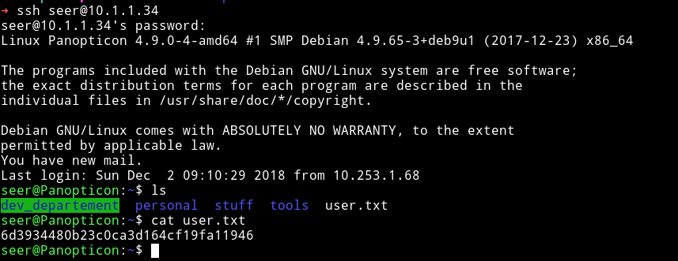

After pwning user I started to look around and found something in the folder `dev_development`

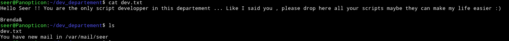

But the moment I did the `ls` after that I got this weird message saying `You have a new mail in /var/mail/seer`. This mean a cron job is running.
So I looked around in the `cron.d` and other `cron.*` folders but found nothing.

After that I decided to `cat` the `/var/mail/seer` but it was a very big so I `grep` it with `Subject` and found few interesting things.

I got few lines like

```bash
Subject: Cron <root@Panopticon> /home/seer/update.sh
Subject: Cron <root@Panopticon> /home/seer/update.sh
Subject: Cron <root@Panopticon> /home/seer/update.sh
Subject: Cron <root@Panopticon> /home/seer/update.sh
Subject: *** SECURITY information for Panopticon.Panopticon ***
Subject: Cron <root@Panopticon> bash /var/tmp/.lol.sh
Subject: Cron <root@Panopticon> bash /var/tmp/.lol.sh
Subject: Cron <root@Panopticon> bash /var/tmp/.lol.sh
Subject: Cron <root@Panopticon> bash /var/tmp/.lol.sh
Subject: Cron <root@Panopticon> bash /var/tmp/.lol.sh
Subject: Cron <root@Panopticon> bash /var/tmp/.lol.sh
Subject: Cron <root@Panopticon> bash /var/tmp/.lol.sh
Subject: Cron <root@Panopticon> bash /var/tmp/.lol.sh
Subject: Cron <root@Panopticon> bash /var/tmp/.lol.sh
Subject: Cron <root@Panopticon> bash /var/tmp/.lol.sh
Subject: Cron <root@Panopticon> /bin/run-parts  /home/seer/dev_departement/*
Subject: Cron <root@Panopticon> /bin/run-parts  /home/seer/dev_departement/*
Subject: Cron <root@Panopticon> /bin/run-parts  /home/seer/dev_departement/*
Subject: Cron <root@Panopticon> /bin/run-parts  /home/seer/dev_departement/*
Subject: Cron <root@Panopticon> for f in /home/seer/dev_departement/*.py ; do  /usr/bin/python3 "$f" done
Subject: Cron <root@Panopticon> bash /var/tmp/.lol.sh
Subject: Cron <root@Panopticon> bash /var/tmp/.lol.sh
Subject: Cron <root@Panopticon> bash /var/tmp/.lol.sh
..................
```

The two suspicious things are:

1) `/var/tmp/.lol.sh`

    I tried to cat it but got permission denied so I assumed that this is the `cron` responsible for giving out that message.

2) `for f in /home/seer/dev_departement/*.py ; do  /usr/bin/python3 "$f" done`

    This is the key to heaven :smile:
    This line is basically taking any `python` file from the `dev_developement` folder and is executing it.

    Using this we can write a python script which will read the `root.txt`

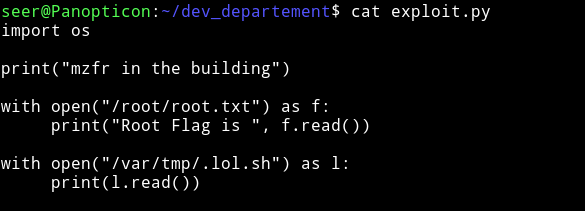

Along with reading the `root.txt` I also read the `.lol.sh` file to see what was that script doing.

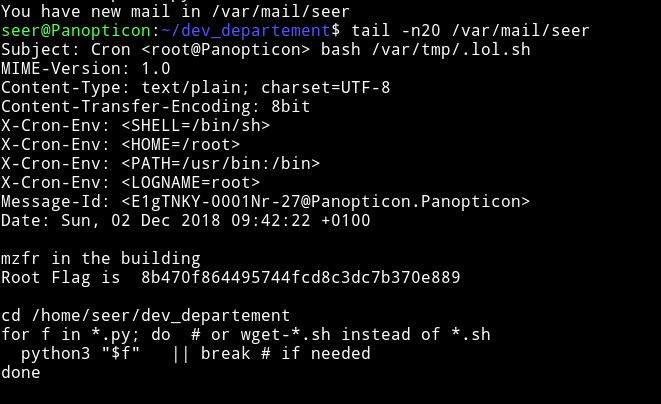

----

__END DATE__: 16/05/2019

__END TIME__: 10:21 AM
