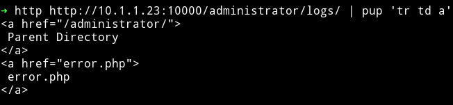

# Rosee

__MACHINE IP__: 10.1.1.42

__DATE__: 7/10/2019

__START TIME__: 12:51 PM

## NMAP


So there are 3 ports open. We'll start our enumeration with HTTP service on port 80.

## HTTP


I didn't find anything in the source or any links. So I ran `dirsearch` on it.


But nothing here seems interesting here since all of these directorys looks like some default dirs.

So I started `dirsearch` on port `10000`.


I searched the `/administrator` and found 2 URLs


And in `/logs` I found `/error.php`



But in `/error.php` I got nothing.


So I tried to search `/blog` and noticed that it was running `joomla` so I used `joomscan` to see if I can find anything.


This also didn't find anything. So again I had to message [@4ndreq]() and he said that I should do `OSINT of an email`. But obviously first I need to find that email. I realized there was an email on the website running on port 80 in `contact us` section. I googled that and found [pastebin](https://pastebin.pl/view/f1b64ad3) post with password in it.

```
hometowncebu@gmail.com:cabergas08
```

Using `cebu:cabergas08` I was able to log in admin in joomla.

## Reverse shell

To get reverse shell we can go to `Extension > template > templates > beez3 > error.php` and in that just copy paste the code to get reverse shell.


Then you can setup your listner `nc -nlvp 4444` and trigger the shell by running visiting `http://10.1.1.23:10000/blog/templates/beez3/error.php`.


### Pwn user

Since I already know the password for `cebu` I did `su cebu` and entered `cabergas08` to become `cebu`


Also to get a proper shell I added my public key to `authorized_key` under `.ssh/` folder.

```bash
$ echo "your public key" > authorized_keys
```

## Privilege escalation

I ran my enumeration script and found a SUID.


To see what that SUID was I executed `sudo.old --help` and got the options for `bash`. Meaning the suid is `bash` but renamed to something else.


So to get root shell from this we can do `sudo.old -p`.


Then we can get the root flag.


***

This was machine was fun todo. Thanks to [@H4d3s]() for making this machine.

***

Thanks for reading, Feedback is always appreciated.

Follow me [@0xmzfr](https://twitter.com/0xmzfr) for more “Writeups”.
