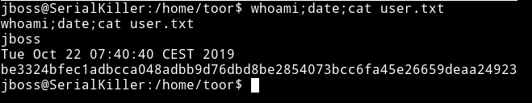
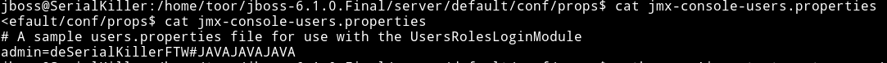

# Serial Killer

__MACHINE IP__: 10.1.1.59

__DATE__: 29/10/2019

__START TIME__: 1:43 PM

## NMAP

There are lot of ports opened that seemed to run java applications.

## HTTP

If we look at the application running at port 80 we can see some `note taking app`.

I didn't spent anytime on this since there was java service running all over this machine. Also in one way the name of the machine is the hint to what kind of attack this could be. `Serialkiller` hint toward some kind of Object De-Serialization. And as we saw in the namp scan there were ports doing some `Java Object Serialization`. So instead of looking around the website I decided to use [Jexboss](https://github.com/joaomatosf/jexboss). It's a tool that look for Java Deserialization Vulnerabilities.

I ran `python jexboss.py -host http://10.1.1.59:8080` and it found some vulnerabilities.

Then it offered to exploit those vulnerability to get a reverse shell, so I let `jexboss` do it's job :-)

And my listener was running on that which basically gave me reverse shell on the machine.

The first thing I did was grabbed a `user.txt` from `/home/toor`

## Privelege escaltion

I download the enumeration script to see if I can find something but I couldn't see anything interesting in it.

Then I started to look around in the `/home/toor` directory since there was some jboss files and a folder named `jboss-6.1.0.Final`.

In `/home/toor/jboss-6.1.0.Final/server/default/conf/props` I found some files named `jmx-console-users.properties` etc.

That file had the password for `root` user.

