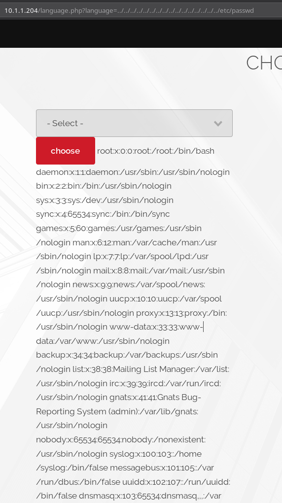

# Silver

__MACHINE IP__: 10.1.1.204

__DATE__: 14/10/2019

__START TIME__: 7:50


# NMAP


There are quite a few port open. Let start our enumeration from HTTP.

## HTTP


So I started to look around the website. There was nothing in the source of the website but in the top right we can see an option for menu. There were 4 options out of which one stood out, that was the `language.php`. It stood out because it had `.php` extension and all the other had `.html`.

So I decided to check it out.

When we open that page we get option to select language and once you do that the URL changes to something like `IP/language.php?language=english`, since now we have a parameter I decided to check it out for `LFI`.

I tried

```
http://10.1.1.204/language.php\?language\=../../../../../../../../../../../../../../../../etc/passwd
```



and to my surprise there was LFI. But there was one more interesting thing in the output of `/etc/passwd`, we were given password for `silver` SSH.


I used that to login via SSH as `silver`.


Then I got the user hash.


## Privilege Escalation

Since I was in the system I downloaded the enumeration script and ran it to see if I can find anything. There were no SUIDs but I did found out that the kernel used was very old.


And I actually know the exploit that will work on it, cause I've done quite a few machines with that exploit being used in them(`grimreaper` and `goldeneye`). The exploit we need here is the [`overlayfs`](https://www.exploit-db.com/exploits/37292).

I copied the exploit to the system and then just compiled it with

```bash
gcc exploit.c -o ofs
```

And then ran the exploit to get the root-shell.


***

This was really easy machine I rooted the maachine in under 20 minutes. But I guess I enjoyed the speed run.

***


