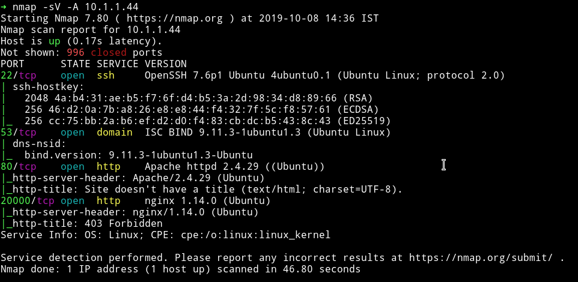
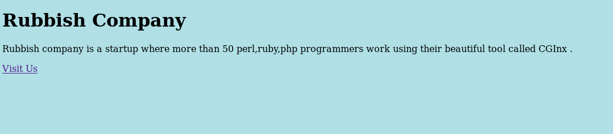
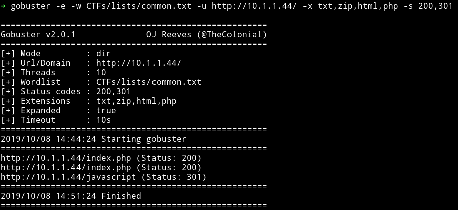
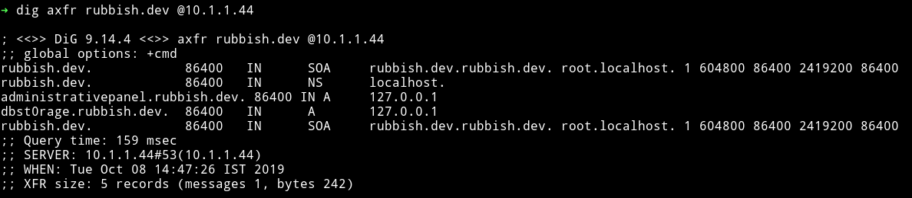
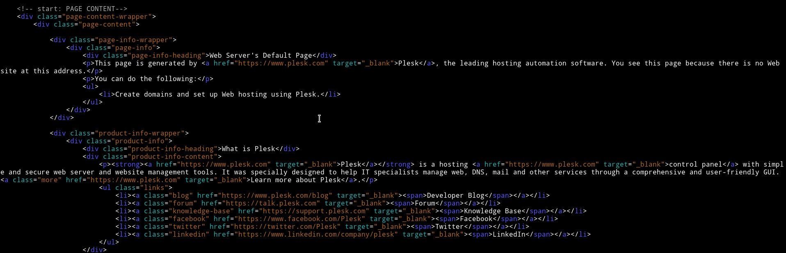

# Rubbish

__MACHINE IP__: 10.1.1.44

__DATE__: 1/05/2019

__START TIME__: 2:36 PM


## NMAP



We can see that there are HTTP service running on 2 ports. Let's start our enumeration from port 80

## HTTP



We can see that there is a `Visti Us` link which takes us to `rubbish.dev`. Opening that just takes us to another simple web page.


Since both of these didn't had any information I decided to run `gobuster` on it.



When I tried to open `/javascript`  I got `forbidden` message. Then I decided to use `dig` because I noticed that there was a DNS server running on port 53.

So I ran

```bash
$ dig axfr rubbish.dev @10.1.1.44
```


`administrativepanel.rubbish.dev`
`dbst0rage.rubbish.dev`

Now according to author he made the machine before Google bought `.dev` domain. So now if we try to open that in our browser it will redirect to HTTPS and that will cause a problem. So I decided to use httpie or curl.



We can see that it talks about some `plesk` software/application so I decided to search it for exploit using `searchsploit` and found some vulnerability but the issue was I was not sure of what version that plesk was. After spending
