# Katana

__MACHINE IP__: 10.1.1.52

__DATE__: 9/10/2019

__START TIME__: 11:36 PM

## NMAP

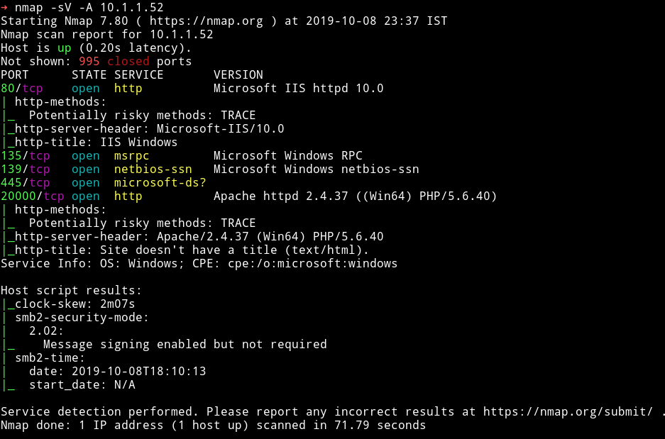

So quite a few ports open. Let's start our enumeration from HTTP services.

## HTTP

I started running `nikto` scan on the port `80` and `20000`, that showed that port 20000 allowed `TRACE` http method but there were no cookie or anything like that there so I could'nt use it.

With gobuster I found `aspnet_client` directory on port `80`

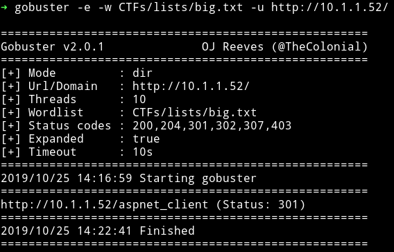

When I ran another scan on `IP/aspnet_client` I found another directory

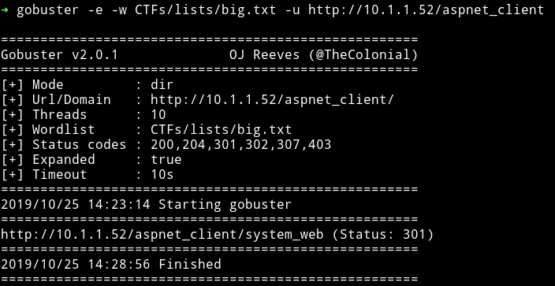

But after that I got nothing and none of those directory had anything in them.
Then I ran `gobuster` scan on port `20000` and that's where I found few 200 and few 301 directory.

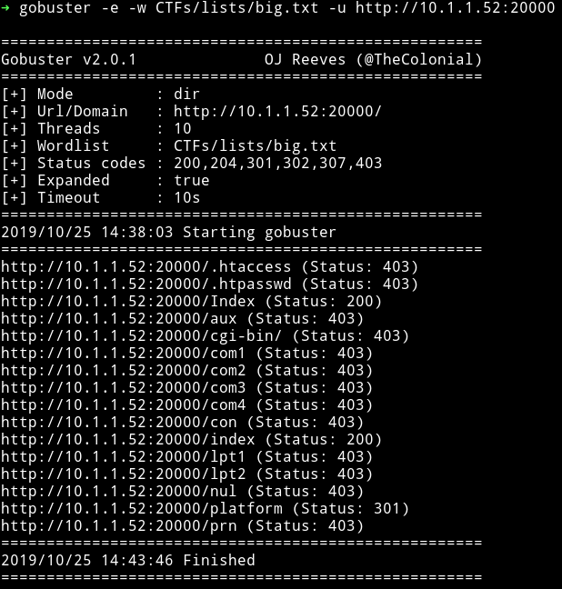

The interesting one was the `/platform` one because there I found `manhali` running.

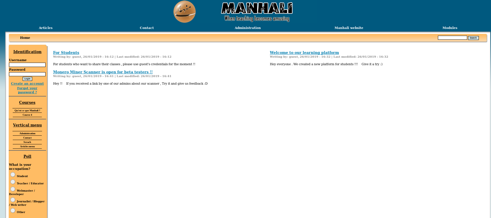

After looking at this kind of `software` running I searched it with searchsploit and found [Manhali 1.8 - Local File Inclusion](https://www.exploit-db.com/exploits/21418).

It said that there was LFI on `/manhali/includes/download.php?f=../includes/dbconfig.php`.

I tried to include the same file and it worked.

```bash
➜ http -b http://10.1.1.52:20000/platform/includes/download.php/\?f\=../includes/dbconfig.php
```

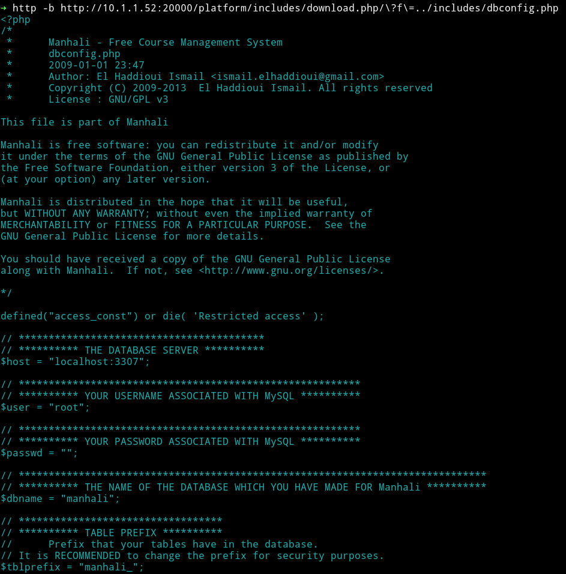

But I was confused with how to use this vulnerability properly. Then after sometime I decided to just look around the platform. If we look at the articles one of the article mentions about guest login.

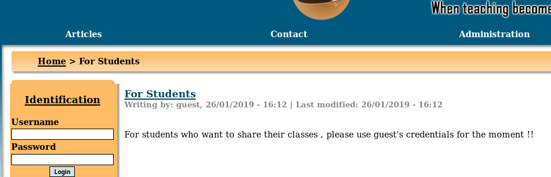

So I used `guest:guest` as credentials and I was able to login.

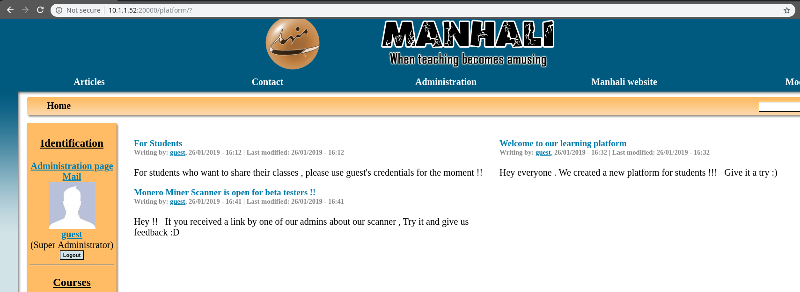

In the file manager section I found out that there was a `docx` file present so I decided to check it out.

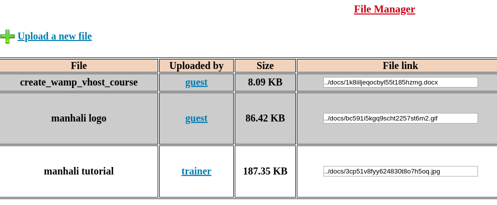

I downloaded the file from `10.1.1.52:20000/platform//docs/1k8iiljeqocbyl55t185hzmg.docx` and it had some information about some vhost file.

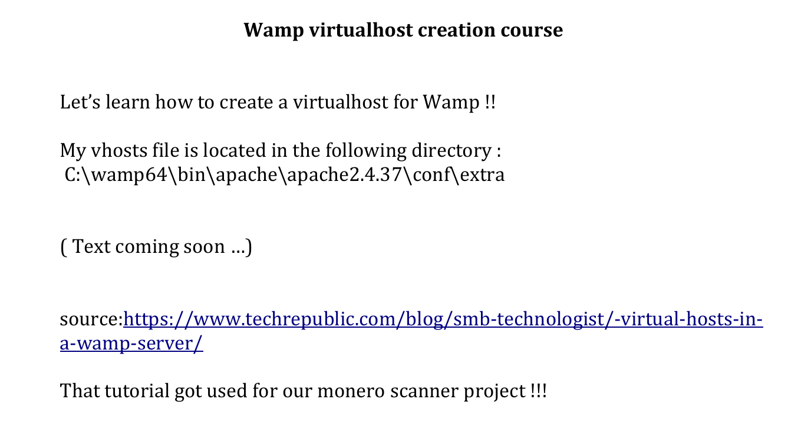

This could mean that we need to use LFI to see this file i.e `C:\wamp64\bin\apache\apache2.4.37\conf\extra`

I read that file using the LFI

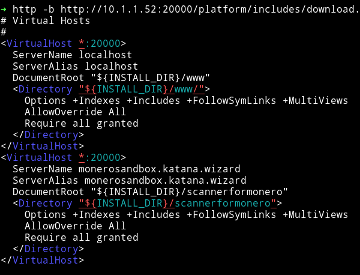

We can see that there is a new domain `monerosandbox.katana.wizard` and also there is a folder name `/scannerformonero`.


